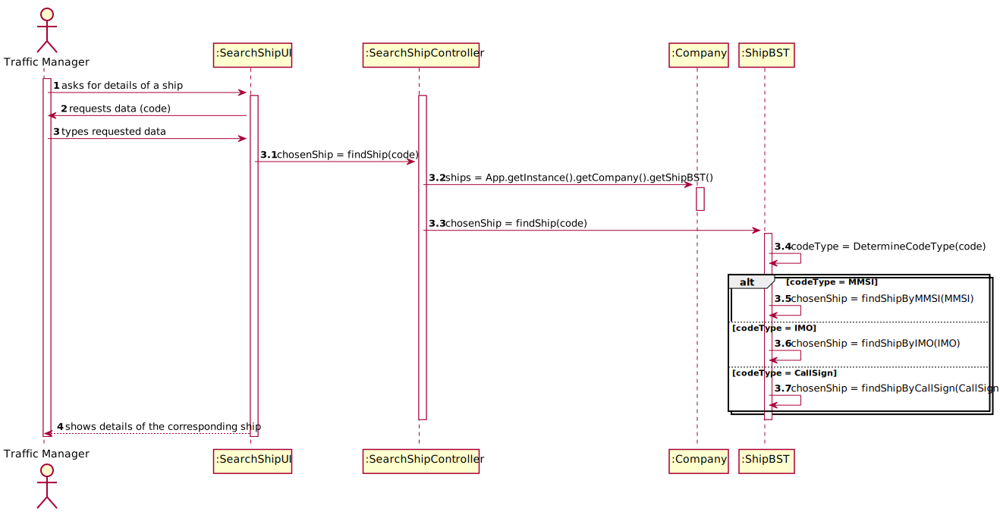
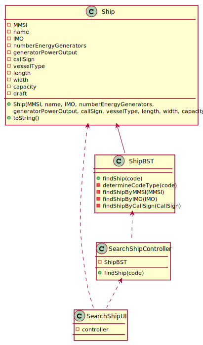

# US 009 -  To search the details of a ship using any of its codes

## 1. Requirements Engineering

### 1.1. User Story Description

As a traffic manager I wish to search the details of a ship using any of its codes: MMSI, IMO or Call Sign.

### 1.2. Customer Specifications and Clarifications 

**From the specifications document:**

>	Ships are characterized by:  
    • MMSI: unique 9-digit ship identification code.  
    • Ship name.  
    • Ship identification according to the IMO identification number5.  
    o IMO: unique 7-digit international identification number, which remains
    unchanged after transferring the ship's registration to another country.  
    • Numbers of energy generators.  
    • Generator’s power output.  
    o Let us assume that all generators provide the same power output.  
    • Call sign: ship's unique callsign.  
    • Vessel type: ship type, numerically coded.  
    • Length: ship length, in meters.  
    • Width: ship width, in meters.  
    • Capacity: ship load capacity in m3.  
    o Ship maximum capacity according to a container mapping (using a three-axis
    displacement).  
    • Draft: Vertical distance between the waterline and the bottom of the ship's hull, in meters.
    Varies with ship load and water density  
    Dynamic data fields relating to a ship's positioning data:  
    • Base Date Time: date/time of AIS message.  
    • Latitude: ship latitude (in degrees: [-90; 90], negative value represents South, 91 indicates
    'not available').  
    • Longitude: ship longitude (in degrees: [-180; 180], negative value represents West, 181
    indicates 'not available').  
    • Speed over ground (SOG).  
    • Course over ground (COG): direction relative to absolute North (in degrees: [0; 359]).  
    • Heading: ship heading (in degrees: [0; 359], 511 indicates 'not available').  
    • Position: ship code in tow.  
    • Transceiver Class: class to transceiver used when sending data.  

**From the client clarifications:**

> **Question:** 
>  
> **Answer:** 

--

### 1.3. Acceptance Criteria

* **AC1:** correct use of OOP concepts.

### 1.4. Found out Dependencies

* There is a dependency to "US101: Import ships from a text file into a BST" since there must be ships registered in the system.

### 1.5 Input and Output Data

**Input Data:**

* Selected data:
    * type of code

* Typed data:
	* a code of the selected type (MMSI, IMO, or Call Sign)

**Output Data:**

* Details of the corresponding ship

### 1.6. Use Case Diagram (UCD)

### 1.7. System Sequence Diagram (SSD)

### 1.8 Other Relevant Remarks

none

## 2. OO Analysis

### 2.1. Relevant Domain Model Excerpt 

### 2.2. Other Remarks

none

## 3. Design - User Story Realization 

### 3.1. Rationale

| Interaction ID | Question: Which class is responsible for... | Answer  | Justification (with patterns)  |
|:-------------  |:--------------------- |:------------|:---------------------------- |
| Step 1 | ... interacting with the actor? | SearchShipUI | Pure Fabrication: there is no reason to assign this responsibility to any existing class in the Domain Model. | 

### Systematization ##

According to the taken rationale, the conceptual classes promoted to software classes are: 

 * 

Other software classes (i.e. Pure Fabrication, DTO) identified: 

 * 

## 3.2. Sequence Diagram (SD)

## 3.3. Class Diagram (CD)

# 4. Tests 

**Test 1: .**

# 5. Construction (Implementation)

## Class 

# 6. Integration and Demo 

* Added a new option on the Traffic Manager menu.

# 7. Observations

none