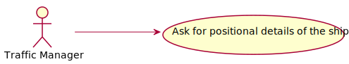
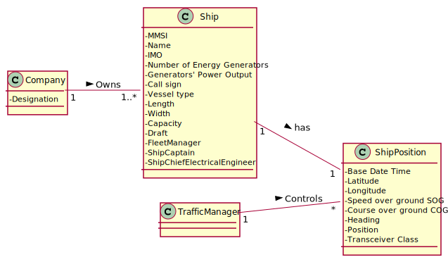
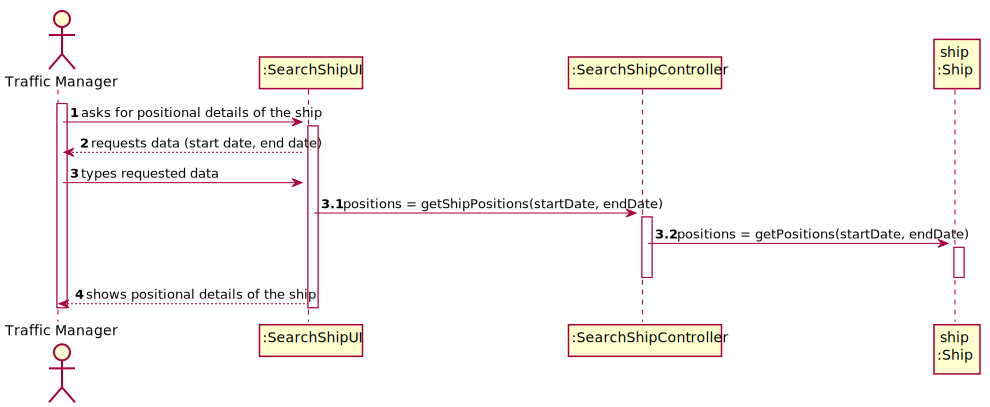
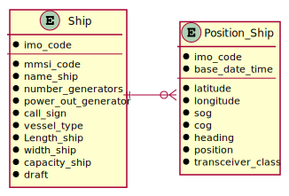
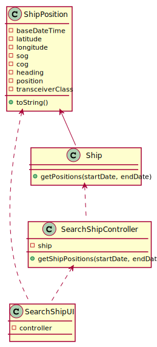

# US 103 - Positional Messages

## 1. Requirements Engineering

### 1.1. User Story Description

As a traffic manager I which to have the positional messages temporally organized and associated with each of the ships.

### 1.2. Customer Specifications and Clarifications 

**From the specifications document:**

>	Dynamic data fields relating to a ship's positioning data:  
    • Base Date Time: date/time of AIS message.  
    • Latitude: ship latitude (in degrees: [-90; 90], negative value represents South, 91 indicates
    'not available').  
    • Longitude: ship longitude (in degrees: [-180; 180], negative value represents West, 181
    indicates 'not available').  
    • Speed over ground (SOG).  
    • Course over ground (COG): direction relative to absolute North (in degrees: [0; 359]).  
    • Heading: ship heading (in degrees: [0; 359], 511 indicates 'not available').  
    • Position: ship code in tow.  
    • Transceiver Class: class to transceiver used when sending data.  

**From the client clarifications:**

> **Question: ?** 
>  
> **Answer: .** 

### 1.3. Acceptance Criteria

* **AC1:** efficient access of any position value(s) of a ship on a period or date.

### 1.4. Found out Dependencies

* There is a dependency to "US102: search the details of a ship" since a ship must first be selected.

### 1.5 Input and Output Data

**Input Data:**

* Typed data:
	* start date
	* end date

* Selected data:
    * none

**Output Data:**

* Positional details of the ship

### 1.6. Use Case Diagram (UCD)

### 1.7. System Sequence Diagram (SSD)

### 1.8 Other Relevant Remarks

none

## 2. OO Analysis

### 2.1. Relevant Domain Model Excerpt 

### 2.2. Other Remarks

none

## 3. Design - User Story Realization 

### 3.1. Rationale

| Interaction ID | Question: Which class is responsible for... | Answer | Justification (with patterns)  |
|:-------------  |:--------------------- |:------------|:---------------------------- |

### Systematization ##

According to the taken rationale, the conceptual classes promoted to software classes are: 

 * 

Other software classes identified: 

 * 
 
## 3.2. Sequence Diagram (SD)

## 3.3. Relational Model (RM)

## 3.4. Class Diagram (CD)

# 4. Tests 

**Test 1: .**  

# 5. Construction (Implementation)

## Class 

# 6. Integration and Demo 

* 

# 7. Observations

none