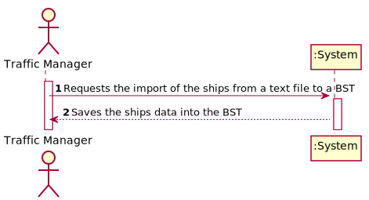
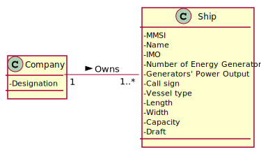
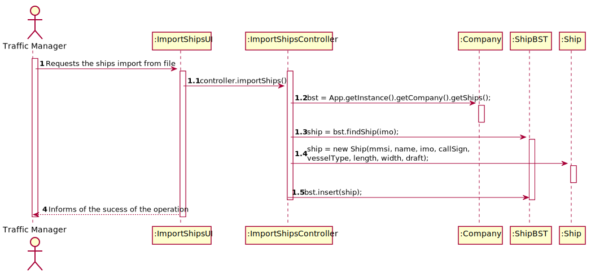
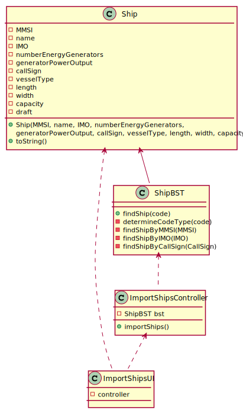

# US 102 -  To search the details of a ship using any of its codes

## 1. Requirements Engineering

### 1.1. User Story Description

As a traffic manager I wish to import the ships from a text file to a BST.

### 1.2. Customer Specifications and Clarifications 

**From the specifications document:**

**From the client clarifications:**

> **Question:** 
>  
> **Answer:**

### 1.3. Acceptance Criteria

* **AC1:** no data lost.

### 1.4. Found out Dependencies

* No dependencies.

### 1.5 Input and Output Data

**Input Data:**

* Typed data:
	* a parameter to import ships.

* Selected data:
    * none

**Output Data:**

* AVL Tree with the ships by parameter.

### 1.6. Use Case Diagram (UCD)

### 1.7. System Sequence Diagram (SSD)

### 1.8 Other Relevant Remarks

none

## 2. OO Analysis

### 2.1. Relevant Domain Model Excerpt 

### 2.2. Other Remarks

none

## 3. Design - User Story Realization 

### 3.1. Rationale

| Interaction ID | Question: Which class is responsible for... | Answer | Justification (with patterns)  |
|:-------------  |:--------------------- |:------------|:---------------------------- |
| Step 1 | ... interacting with the actor? | ImportShipsUI | Pure Fabrication: there is no reason to assign this responsibility to any existing class in the Domain Model. | 
| 	     | ... coordinating the US? | ImportShipsController | Controller |
| Step 2 | ... asking for the required data? | ImportShipsUI | IE: is responsible for user interactions. |
| Step 3 | ... showing the ships to the user? | ImportShipsUI | IE: is responsible for user interactions. |             

### Systematization ##

According to the taken rationale, the conceptual classes promoted to software classes are: 

 * 

Other software classes identified: 

 * ImportShipsUI
 * ImportShipsController
 
## 3.2. Sequence Diagram (SD)

## 3.3. Relational Model (RM)

## 3.4. Class Diagram (CD)

# 4. Tests 

**Test 1: .**  

# 5. Construction (Implementation)

## Class 

# 6. Integration and Demo 

* Added a new option on the Traffic Manager menu.

# 7. Observations

none