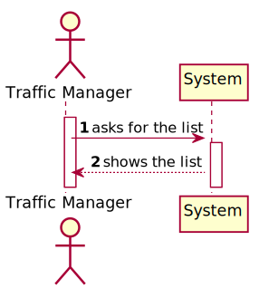

# US 102 -  To search the details of a ship using any of its codes

## 1. Requirements Engineering

### 1.1. User Story Description

As a traffic manager I wish to list for all ships the MMSI, the total number of
movements, Travelled Distance and Delta Distance

### 1.2. Customer Specifications and Clarifications

**From the specifications document:**

**From the client clarifications:**

> **Question:**
>When is asked to return the information ordered by TraveledDistance and Number of movements
> , is to list the information two times, one being ordered 
> by the traveled distance and one being ordered 
> by the number of movements? Or is to list the information one time being ordered by the traveled distance(descending) 
> and after being ordered by the traveled distance, 
> order the same information by the number of movements(ascending)?
>
> **Answer:**
> list the information one time being ordered by the traveled distance(descending) and after being ordered by the traveled distance

### 1.3. Acceptance Criteria

* **AC1:** The list must be ordered by Travelled Distance and total number of movements
  (descending/ascending).

### 1.4. Found out Dependencies

* .

### 1.5 Input and Output Data

**Input Data:**

* Typed data:
    * MMSI of the ship
    * Delta distance
    * Traveled distance

* Selected data:
    * none

**Output Data:**

* A list that contains the total number of
  movements, Travelled Distance and Delta Distance of all the ships.

### 1.6. Use Case Diagram (UCD)

### 1.7. System Sequence Diagram (SSD)

### 1.8 Other Relevant Remarks

none

## 2. OO Analysis

### 2.1. Relevant Domain Model Excerpt

### 2.2. Other Remarks

none

## 3. Design - User Story Realization

### 3.1. Rationale

| Interaction ID | Question: Which class is responsible for... | Answer | Justification (with patterns)  |
|:-------------  |:--------------------- |:------------|:---------------------------- |
| Step 1 | ... interacting with the actor? | ShipMovementsAndDistanceUI | Pure Fabrication: there is no reason to assign this responsibility to any existing class in the Domain Model. | 
| 	     | ... coordinating the US? | ShipMovementsAndDistanceController | Controller |
| Step 2 | ... showing the list? | ShipMovementsAndDistance | IE: is responsible for user interactions. |             

### Systematization ##

According to the taken rationale, the conceptual classes promoted to software classes are:

*

Other software classes identified:

* ShipMovementsAndDistanceUI
* ShipMovementsAndDistanceController

## 3.2. Sequence Diagram (SD)

## 3.3. Relational Model (RM)

## 3.4. Class Diagram (CD)

# 4. Tests

**Test 1: .**

# 5. Construction (Implementation)

## Class

# 6. Integration and Demo

* Added a new option on the Traffic Manager menu.

# 7. Observations

none