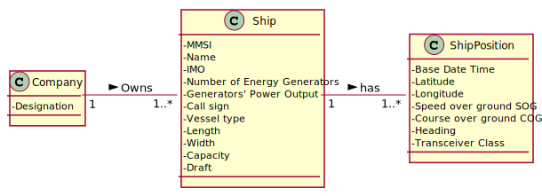
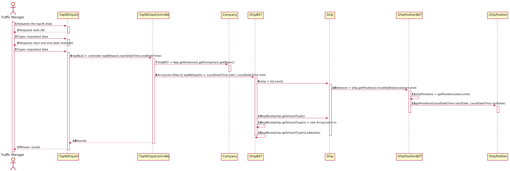

# US 106 -  To search the details of a ship using any of its codes

## 1. Requirements Engineering

### 1.1. User Story Description

As User I wish to get the top-N ships with the most kilometres travelled and their average speed
(MeanSOG).

### 1.2. Customer Specifications and Clarifications 

**From the specifications document:**

>	Ships are characterized by:  
    * MMSI: unique 9-digit ship identification code.  
    * Ship name.  
    * Ship identification according to the IMO identification number.  
    * Numbers of energy generators.  
    * Generator’s power output.    
    * Call sign: ship's unique callsign.  
    * Vessel type: ship type, numerically coded.  
    * Length: ship length, in meters.  
    * Width: ship width, in meters.  
    * Capacity: ship load capacity in m3.
    * Draft: Vertical distance between the waterline and the bottom of the ship's hull, in meters.

>   Dynamic data fields relating to a ship's positioning data:
    * Base Date Time: date/time of AIS message.
    * Latitude: ship latitude (in degrees: [-90; 90], negative value represents South, 91 indicates 'not available').
    * Longitude: ship longitude (in degrees: [-180; 180], negative value represents West, 181 indicates 'not available').
    * Speed over ground (SOG).
    * Course over ground (COG): direction relative to absolute North (in degrees: [0; 359]).
    * Heading: ship heading (in degrees: [0; 359], 511 indicates 'not available').
    * Position: ship code in tow.
    * Transceiver Class: class to transceiver used when sending data.

### 1.3. Acceptance Criteria

* **AC1:** In a period (initial/final Base Date Time) grouped by Vessel Type.

### 1.4. Found out Dependencies

* There are dependencies from UC101 since the ships have to be already imported.

### 1.5 Input and Output Data

**Input Data:**

* Typed data:
	* Number of ships, start and end date (interval)

* Selected data:
    * none

**Output Data:**
* Top N Ships for each VesselType in a period, their MMSI, VesselType, Distance Travelled and Mean SOG.

### 1.6. Use Case Diagram (UCD)

### 1.7. System Sequence Diagram (SSD)

### 1.8 Other Relevant Remarks

none

## 2. OO Analysis

### 2.1. Relevant Domain Model Excerpt 

### 2.2. Other Remarks

none

## 3. Design - User Story Realization 

### 3.1. Rationale

| Interaction ID | Question: Which class is responsible for... | Answer | Justification (with patterns)  |
|:-------------  |:--------------------- |:------------|:---------------------------- |
| Step 1 | ... interacting with the actor? | TopNShipsUI | Pure Fabrication: there is no reason to assign this responsibility to any existing class in the Domain Model. | 
| 	     | ... coordinating the US? | TopNShipsController | Controller |
| Step 2 | ... knowing the information of the ship position? | ShipPosition | IE: Owns all its attributes. |
| Step 3 | ... knowing the information of the ship? | Ship | IE: Owns all its attributes. |
| Step 4 | ... have the tree with the ships?| ShipBST | It´s a "store" class. |
| Step 5 | ... have the tree with the ships positions?| ShipPositionBST | It´s a "store" class. |

### Systematization ##

According to the taken rationale, the conceptual classes promoted to software classes are: 

 * Ship
 * ShipPosition

Other software classes identified: 

 * TopNShipsUI
 * TopNShipsController
 
## 3.2. Sequence Diagram (SD)

## 3.3. Relational Model (RM)

## 3.4. Class Diagram (CD)

# 4. Tests 

**Test 1: .**  

# 5. Construction (Implementation)

## Class ImportShipsController

# 6. Integration and Demo 

* Added a new option on the Traffic Manager menu.

# 7. Observations

none