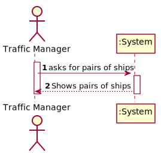
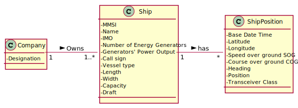
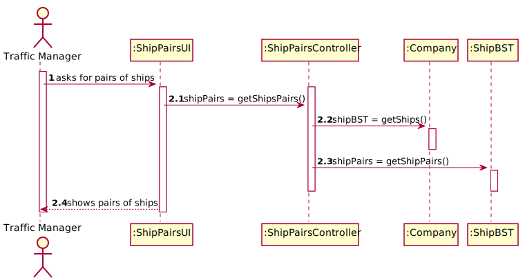
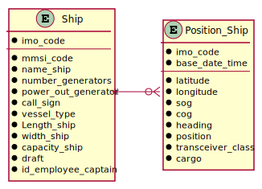
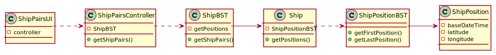

# US 107 - Pairs of Ships

## 1. Requirements Engineering

### 1.1. User Story Description

Return pairs of ships with routes with close departure/arrival coordinates (no more than 5 Kms away) and with different Travelled Distance.

### 1.2. Acceptance Criteria

* **AC1:** Sorted by the MMSI code of the 1st ship and in descending order of the Travelled Distance difference.
* **AC2:** Do not consider ships with Travelled Distance less than 10 kms.

### 1.3 Input and Output Data

**Input Data:**

* Typed data:
	* none

* Selected data:
    * none

**Output Data:**

* pairs of ships

### 1.4 Use Case Diagram (UCD)

### 1.5 System Sequence Diagram (SSD)

### 1.6 Other Relevant Remarks

none

## 2. OO Analysis

### 2.1. Relevant Domain Model Excerpt 

### 2.2. Other Remarks

none

## 3. Design - User Story Realization 

## 3.1. Sequence Diagram (SD)

## 3.2. Relational Model (RM)

## 3.3. Class Diagram (CD)

# 4. Tests 

    

# 5. Construction (Implementation)

## Class 

# 6. Integration and Demo 

* 

# 7. Observations

none