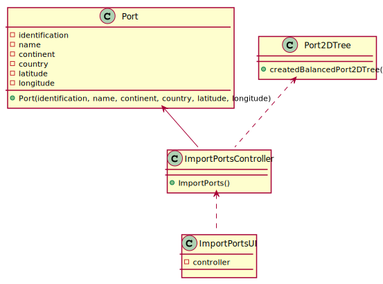

# US 201 - Import Ports

## 1. Requirements Engineering

### 1.1. User Story Description

As a Port manager, I wish to import ports from a text file and create a 2D-tree with port locations.

### 1.2. Customer Specifications and Clarifications 

**From the specifications document:**

> Every Port and Warehouse should have at least the following information:  
• Identification.  
• Name.  
• Continent.  
• Country.  
• Location: latitude and longitude

**From the client clarifications:**

> **Question: ?** 
>  
> **Answer: .** 

### 1.3. Acceptance Criteria

* **AC1:** 2D-tree balanced.

### 1.4 Input and Output Data

**Input Data:**

* Typed data:
	* none

* Selected data:
    * none

**Output Data:**

* none

### 1.6. Use Case Diagram (UCD)

### 1.7. System Sequence Diagram (SSD)

### 1.8 Other Relevant Remarks

none

## 2. OO Analysis

### 2.1. Relevant Domain Model Excerpt 

### 2.2. Other Remarks

none

## 3. Design - User Story Realization 

## 3.1. Sequence Diagram (SD)

## 3.2. Relational Model (RM)

## 3.3. Class Diagram (CD)

# 4. Tests 

    

# 5. Construction (Implementation)

# 6. Integration and Demo 

* 

# 7. Observations

none