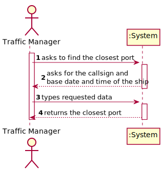

# US 202 - Find the closest port for a given ship

## 1. Requirements Engineering

### 1.1. User Story Description

As a Port manager, I wish to find the closest port of a ship given its CallSign, on a certain DateTime

### 1.2. Customer Specifications and Clarifications 

**From the specifications document:**

> Every Port and Warehouse should have at least the following information:  
• Identification.  
• Name.  
• Continent.  
• Country.  
• Location: latitude and longitude

>Ships are characterized by:
• ...
• Call sign: ship's unique callsign.
• ...
Dynamic data fields relating to a ship's positioning data:
• Base Date Time: date/time of AIS message.
• Latitude: ship latitude (in degrees: [-90; 90], negative value represents South, 91 indicates 'not available').
• Longitude: ship longitude (in degrees: [-180; 180], negative value represents West, 181 indicates 'not available')

### 1.3. Acceptance Criteria

* **AC1:** using 2D-tree to find closest port.

### 1.4. Found out Dependencies
* There is a dependency with US201:"Import ports", since the program needs the data to calculate the distance between the ports and the ship. 

### 1.5 Input and Output Data

**Input Data:**

* Typed data:
	* Callsign of the ship

* Selected data:
    * none

**Output Data:**

* closest port

### 1.6. Use Case Diagram (UCD)

### 1.7. System Sequence Diagram (SSD)

### 1.8 Other Relevant Remarks

none

## 2. OO Analysis

### 2.1. Relevant Domain Model Excerpt 

### 2.2. Other Remarks

none

## 3. Design - User Story Realization 

## 3.1. Sequence Diagram (SD)

## 3.2. Relational Model (RM)

## 3.3. Class Diagram (CD)

# 4. Tests 

    

# 5. Construction (Implementation)

# 6. Integration and Demo 

* 

# 7. Observations

none