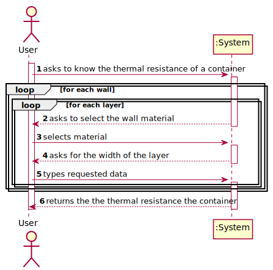
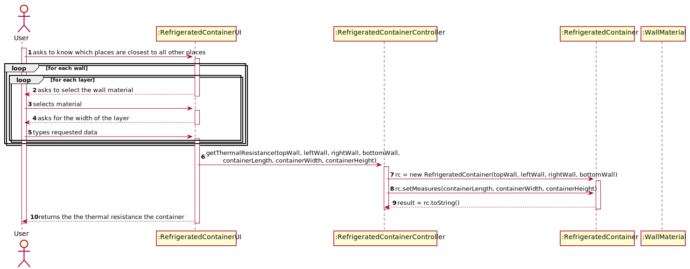
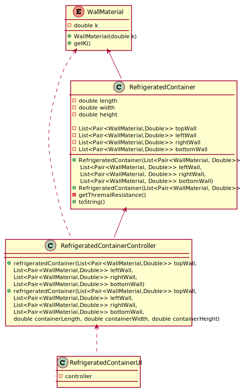

# Container's Walls

## 1. Requirements Engineering

### 1.1. Description

Calculate the thermal resistance of a container, with chosen wall materials and widths.

### 1.2. Acceptance Criteria

* **AC1:** Thermal resistance of the four walls, top and bottom, left and right.

* **AC2:** Different walls can be made of different materials and/or different widths.

### 1.3 Input and Output Data

**Input Data:**

* Typed data:
	* Width of each material for each wall

* Selected data:
    * Materials for each wall

**Output Data:**

* Resistance of each wall

### 1.4. System Sequence Diagram (SSD)

### 1.5 Other Relevant Remarks

none

## 2. Design - User Story Realization 

## 2.1. Sequence Diagram (SD)

## 2.2. Class Diagram (CD)

