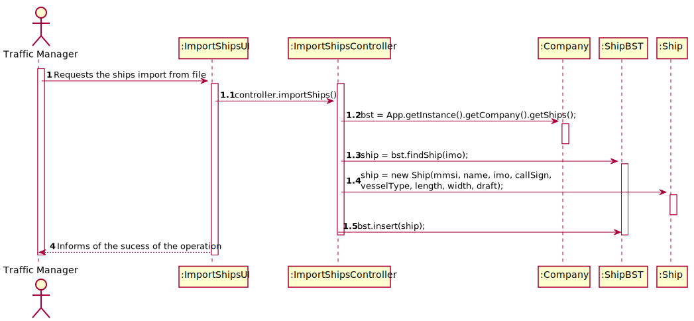

# US 101 -  To search the details of a ship using any of its codes

## 1. Requirements Engineering

### 1.1. User Story Description

As a traffic manager I wish to import the ships from a text file to a BST.

### 1.2. Customer Specifications and Clarifications 

**From the specifications document:**

>	Ships are characterized by:  
    * mmsi: unique 9-digit ship identification code.  
    * Ship name.  
    * Ship identification according to the imo identification number.  
    * Numbers of energy generators.  
    * Generator’s power output.    
    * Call sign: ship's unique callsign.  
    * Vessel type: ship type, numerically coded.  
    * Length: ship length, in meters.  
    * Width: ship width, in meters.  
    * Capacity: ship load capacity in m3.
    * Draft: Vertical distance between the waterline and the bottom of the ship's hull, in meters.

>   Dynamic data fields relating to a ship's positioning data:
    * Base Date Time: date/time of AIS message.
    * Latitude: ship latitude (in degrees: [-90; 90], negative value represents South, 91 indicates 'not available').
    * Longitude: ship longitude (in degrees: [-180; 180], negative value represents West, 181 indicates 'not available').
    * Speed over ground (SOG).
    * Course over ground (COG): direction relative to absolute North (in degrees: [0; 359]).
    * Heading: ship heading (in degrees: [0; 359], 511 indicates 'not available').
    * Position: ship code in tow.
    * Transceiver Class: class to transceiver used when sending data.

### 1.3. Acceptance Criteria

* **AC1:** no data lost.

### 1.4. Found out Dependencies

* No dependencies.

### 1.5 Input and Output Data

**Input Data:**

* Typed data:
	* none

* Selected data:
    * none

**Output Data:**

* none

### 1.6. Use Case Diagram (UCD)

### 1.7. System Sequence Diagram (SSD)

### 1.8 Other Relevant Remarks

none

## 2. OO Analysis

### 2.1. Relevant Domain Model Excerpt 

### 2.2. Other Remarks

none

## 3. Design - User Story Realization 

### 3.1. Rationale

| Interaction ID | Question: Which class is responsible for... | Answer | Justification (with patterns)  |
|:-------------  |:--------------------- |:------------|:---------------------------- |
| Step 1 | ... interacting with the actor? | ImportShipsUI | Pure Fabrication: there is no reason to assign this responsibility to any existing class in the Domain Model. | 
| 	     | ... coordinating the US? | ImportShipsController | Controller |
| Step 2 | ... finding the ship? | ShipBST | IE: Has the means to so. |
| Step 3 | ... knowing the information of the ship? | Ship | IE: Owns all its attributes. |
| Step 4 | ... saving the data imported from the file? | ShipBST | It´s the "store" class. |

### Systematization ##

According to the taken rationale, the conceptual classes promoted to software classes are: 

 * Ship

Other software classes identified: 

 * ImportShipsUI
 * ImportShipsController
 
## 3.2. Sequence Diagram (SD)

## 3.3. Class Diagram (CD)

# 4. Construction (Implementation)

## Class ImportShipsController

                public void importShips() {
                String[] parameters;
                Ship ship;
                try {
                    Scanner in = new Scanner((new FileReader(fileName)));
                    while (in.hasNextLine()) {
                        parameters = in.nextLine().split(",");
                        String imo = parameters[8];
                        ship = bst.findShip(imo);
                        if (ship == null) {
                            String mmsi = parameters[0];
                            String name = parameters[7];
                            String callSign = parameters[9];
                            int vesselType = Integer.parseInt(parameters[10]);
                            int length = Integer.parseInt(parameters[11]);
                            int width = Integer.parseInt(parameters[12]);
                            float draft = Float.parseFloat(parameters[13]);
                            ship = new Ship(mmsi, name, imo, callSign, vesselType, length, width, draft);
                            bst.insert(ship);
                         }

                        String dateTime = parameters[1];
                        int year = Integer.parseInt(dateTime.substring(6, 10));
                        int month = Integer.parseInt(dateTime.substring(3, 5));
                        int day = Integer.parseInt(dateTime.substring(0, 2));
                        int hour = Integer.parseInt(dateTime.substring(11, 13));
                        int minute = Integer.parseInt(dateTime.substring(14, 16));
                        double latitude = Double.parseDouble(parameters[2]);
                        double longitude = Double.parseDouble(parameters[3]);
                        double sog = Double.parseDouble(parameters[4]);
                        double cog = Double.parseDouble(parameters[5]);
                        double heading = Double.parseDouble(parameters[6]);
                        int cargo;
                        if (!parameters[14].equals("NA"))
                            cargo = Integer.parseInt(parameters[14]);
                        else
                            cargo = 0;
                        char transceiverClass = parameters[15].charAt(0);
                LocalDateTime localDateTime = LocalDateTime.of(year, month, day, hour, minute);
                ShipPosition shipPosition = new ShipPosition(localDateTime, latitude, longitude, sog, cog, heading, transceiverClass, cargo);
                ship.addPosition(shipPosition);
                    }
                } catch (IOException e) {
                    e.printStackTrace();
                 }
                }

# 5. Integration and Demo 

* Added a new option on the Traffic Manager menu.

# 6. Observations

none