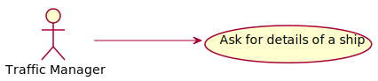
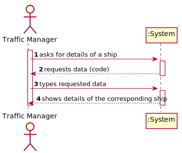
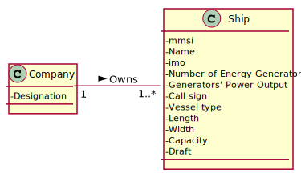
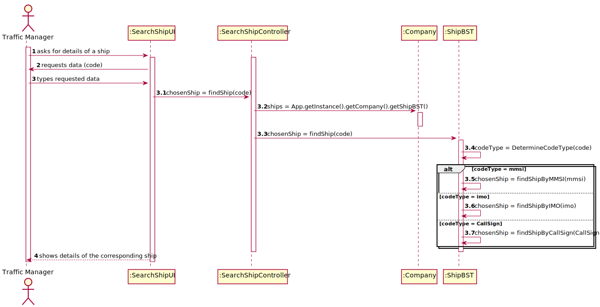
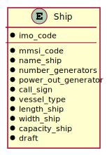
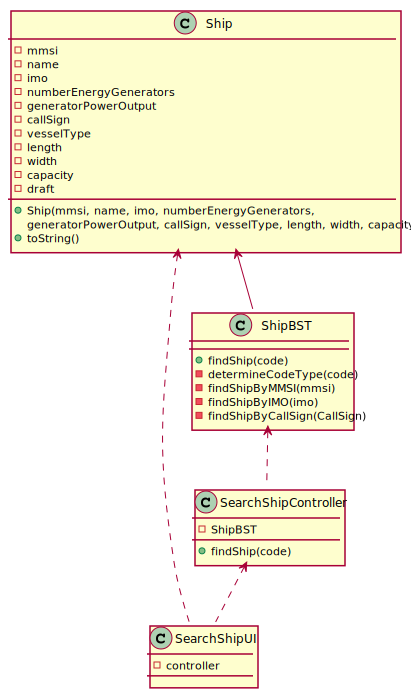

# US 102 -  To search the details of a ship using any of its codes

## 1. Requirements Engineering

### 1.1. User Story Description

As a traffic manager I wish to search the details of a ship using any of its codes: mmsi, imo or Call Sign.

### 1.2. Customer Specifications and Clarifications 

**From the specifications document:**

>	Ships are characterized by:  
    • mmsi: unique 9-digit ship identification code.  
    • Ship name.  
    • Ship identification according to the imo identification number.  
    o imo: unique 7-digit international identification number, which remains
    unchanged after transferring the ship's registration to another country.  
    • Numbers of energy generators.  
    • Generator’s power output.  
    o Let us assume that all generators provide the same power output.  
    • Call sign: ship's unique callsign.  
    • Vessel type: ship type, numerically coded.  
    • Length: ship length, in meters.  
    • Width: ship width, in meters.  
    • Capacity: ship load capacity in m3.  
    o Ship maximum capacity according to a container mapping (using a three-axis
    displacement).  
    • Draft: Vertical distance between the waterline and the bottom of the ship's hull, in meters.
    Varies with ship load and water density.

**From the client clarifications:**

> **Question: Should the traffic manager choose which type of code(mmsi, imo, Call sign) to enter and then enter it or should the system automatically recognize which code is it depending on the syntax of the code?** 
>  
> **Answer: If it is possible, it would be better to recognise it automatically.** 

### 1.3. Acceptance Criteria

* **AC1:** correct use of OOP concepts.

### 1.4. Found out Dependencies

* There is a dependency to "US101: Import ships from a text file into a BST" since there must be ships registered in the system.

### 1.5 Input and Output Data

**Input Data:**

* Typed data:
	* a code of the selected type (mmsi, imo, or Call Sign)

* Selected data:
    * none

**Output Data:**

* Details of the corresponding ship

### 1.6. Use Case Diagram (UCD)

### 1.7. System Sequence Diagram (SSD)

### 1.8 Other Relevant Remarks

none

## 2. OO Analysis

### 2.1. Relevant Domain Model Excerpt 

### 2.2. Other Remarks

none

## 3. Design - User Story Realization 

### 3.1. Rationale

| Interaction ID | Question: Which class is responsible for... | Answer | Justification (with patterns)  |
|:-------------  |:--------------------- |:------------|:---------------------------- |
| Step 1 | ... interacting with the actor? | SearchShipUI | Pure Fabrication: there is no reason to assign this responsibility to any existing class in the Domain Model. | 
| 	     | ... coordinating the US? | SearchShipController | Controller |
| Step 2 | ... asking for the required data? | SearchShipUI | IE: is responsible for user interactions. |
| Step 3 | ... finding the ship? | ShipBST | IE: Has the means to so. |
| Step 4 | ... knowing the information of the ship? | Ship | IE: Owns all its attributes. |
| Step 5 | ... showing the ship details to the user? | SearchShipUI | IE: is responsible for user interactions. |             

### Systematization ##

According to the taken rationale, the conceptual classes promoted to software classes are: 

 * Ship

Other software classes identified: 

 * SearchShipUI
 * SearchShipController
 
## 3.2. Sequence Diagram (SD)

## 3.3. Relational Model (RM)

## 3.4. Class Diagram (CD)

# 4. Tests 

**Test 1: Find a ship by imo code.**  
    @Test  
    void findShipByIMOTest() {  
        Ship expected = ship4;  
        Ship found = shipBST.findShip("IMO9517575");  
        assertEquals(expected, found);  
    }  

**Test 2: Find a ship by mmsi code.**    
    @Test  
    void findShipByMMSITest() {  
        Ship expected = ship4;
        Ship found = shipBST.findShip("235092459");
        assertEquals(expected, found);
    }  

**Test 3: Find a ship by Call Sign code.**    
    @Test  
    void findShipByCallSignTest() {  
        Ship expected = ship4;
        Ship found = shipBST.findShip("2FMJ5");
        assertEquals(expected, found);
    }  

# 5. Construction (Implementation)

## Class ShipBST

    public Ship findShip(String code) {
        String type = determineCodeType(code);
        Ship res;

        if (type.equals("imo")) {
            res = findShipByIMO(code);
        }
        else if (type.equals("mmsi")) {
            res = findShipByMMSI(root, code);
        }
        else {
            res = findShipByCallSign(root, code);
        }

        return res;
    }

    private String determineCodeType(String code) {
        String type;

        if (code.startsWith("imo"))
            type = "imo";
        else if (code.length() == 9)
            type = "mmsi";
        else
            type = "CallSign";

        return type;
    }

    private Ship findShipByIMO(String code) {
        Node<Ship> node = root;
        Ship res = null;
        boolean find = false;

        while (node != null && !find) {
        if (node.getElement().getIMO().equals(code))
            find = true;
        else if (node.getElement().getIMO().compareTo(code) > 0)
            node = node.getLeft();
        else if (node.getElement().getIMO().compareTo(code) < 0)
            node = node.getRight();
        }

        if (find)
            res = node.getElement();

        return res;
    }

    private Ship findShipByMMSI(Node<Ship> node, String code) {
        Ship res = null;

        if (node != null) {
            if (node.getElement().getMMSI().equals(code))
                res = node.getElement();
            if (res == null)
                res = findShipByMMSI(node.getLeft(), code);
            if (res == null)
                res = findShipByMMSI(node.getRight(), code);
        }

        return res;
    }

    private Ship findShipByCallSign(Node<Ship> node, String code) {
        Ship res = null;

        if (node != null) {
            if (node.getElement().getCallSign().equals(code))
                res = node.getElement();
            if (res == null)
                res = findShipByCallSign(node.getLeft(), code);
            if (res == null)
                res = findShipByCallSign(node.getRight(), code);
        }

        return res;
    }

# 6. Integration and Demo 

* Added a new option on the Traffic Manager menu.

# 7. Observations

none