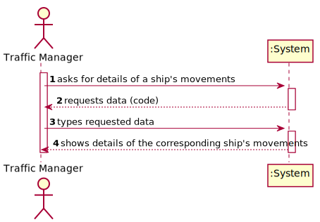
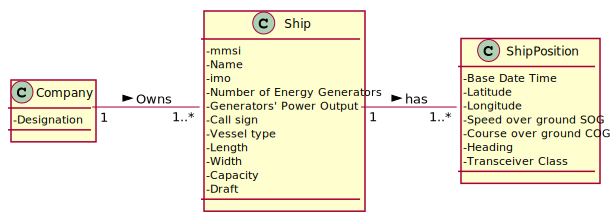
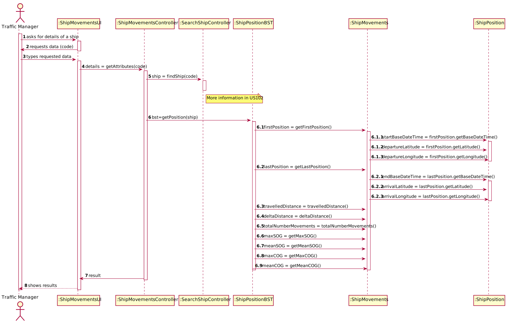
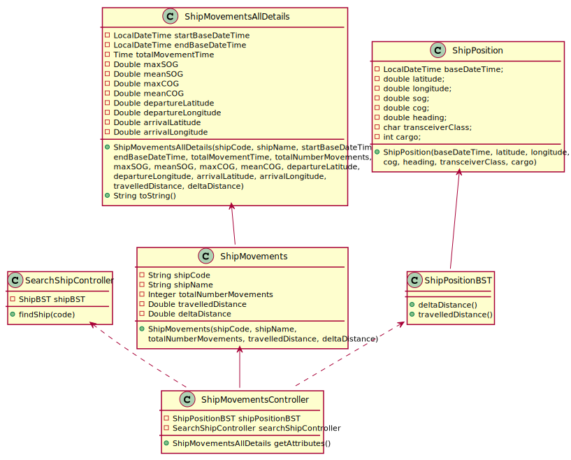

# US 104 -  To make a Summary of a ship's movements

## 1. Requirements Engineering

### 1.1. User Story Description

As a traffic manager I wish to make a Summary of a ship's movements.

### 1.2. Customer Specifications and Clarifications 

**From the specifications document:**

>	Ships are characterized by:  
    * mmsi: unique 9-digit ship identification code.  
    * Ship name.  
    * Ship identification according to the imo identification number.  
    * Numbers of energy generators.  
    * Generator’s power output.    
    * Call sign: ship's unique callsign.  
    * Vessel type: ship type, numerically coded.  
    * Length: ship length, in meters.  
    * Width: ship width, in meters.  
    * Capacity: ship load capacity in m3.
    * Draft: Vertical distance between the waterline and the bottom of the ship's hull, in meters.

>   Dynamic data fields relating to a ship's positioning data:
    * Base Date Time: date/time of AIS message.
    * Latitude: ship latitude (in degrees: [-90; 90], negative value represents South, 91 indicates 'not available').
    * Longitude: ship longitude (in degrees: [-180; 180], negative value represents West, 181 indicates 'not available').
    * Speed over ground (SOG).
    * Course over ground (COG): direction relative to absolute North (in degrees: [0; 359]).
    * Heading: ship heading (in degrees: [0; 359], 511 indicates 'not available').
    * Position: ship code in tow.
    * Transceiver Class: class to transceiver used when sending data.

### 1.3. Acceptance Criteria

* **AC1:** For a given ship return in an appropriate structure one of its codes
           (mmsi, imo or Call Sign), Vessel Name, Start Base Date Time, End
           Base Date Time, Total Movement Time, Total Number of Movements,
           Max SOG, Mean SOG, Max COG, Mean COG, Departure Latitude,
           Departure Longitude, Arrival Latitude, Arrival Longitude, Travelled
           Distance (incremental sum of the distance between each positioning
           message) and Delta Distance (linear distance between the coordinates of
           the first and last move).

### 1.4. Found out Dependencies

* There is a dependency to "US101: Import ships from a text file into a BST" since there must be ships registered in the system.
* There is a dependency to "US103: Have the positional messages temporally organized and associated with each of the ships" for the Travelled Distance calculations and other parameters mentioned in the criteria acceptance.

### 1.5 Input and Output Data

**Input Data:**

* Typed data:
	* a code to identify the ship (mmsi, imo, or Call Sign)

* Selected data:
    * none

**Output Data:**

* Details of the corresponding ship
* Details of the ship's movements

### 1.6. Use Case Diagram (UCD)

### 1.7. System Sequence Diagram (SSD)

### 1.8 Other Relevant Remarks

none

## 2. OO Analysis

### 2.1. Relevant Domain Model Excerpt 

### 2.2. Other Remarks

none

## 3. Design - User Story Realization 

## 3.1. Sequence Diagram (SD)

## 3.2. Relational Model (RM)

## 3.3. Class Diagram (CD)

