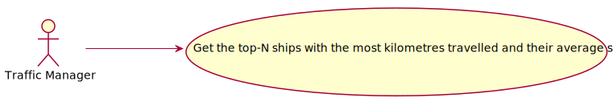
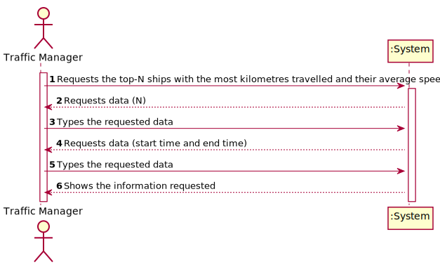
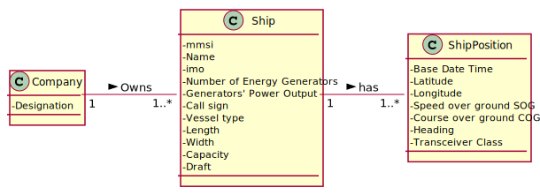
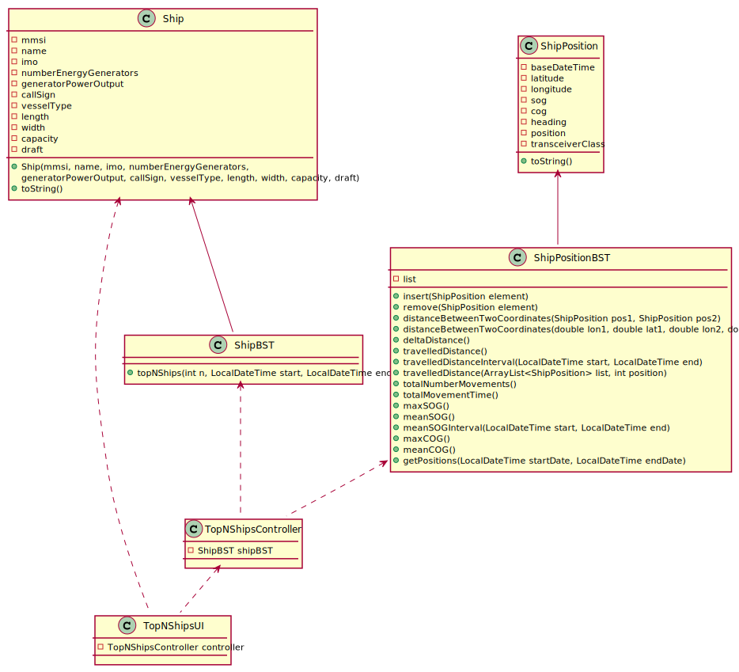

# US 106 -  To search the details of a ship using any of its codes

## 1. Requirements Engineering

### 1.1. User Story Description

As Traffic Manager I wish to get the top-N ships with the most kilometres travelled and their average speed
(MeanSOG).

### 1.2. Customer Specifications and Clarifications 

**From the specifications document:**

>	Ships are characterized by:  
    * mmsi: unique 9-digit ship identification code.  
    * Ship name.  
    * Ship identification according to the imo identification number.  
    * Numbers of energy generators.  
    * Generator’s power output.    
    * Call sign: ship's unique callsign.  
    * Vessel type: ship type, numerically coded.  
    * Length: ship length, in meters.  
    * Width: ship width, in meters.  
    * Capacity: ship load capacity in m3.
    * Draft: Vertical distance between the waterline and the bottom of the ship's hull, in meters.

>   Dynamic data fields relating to a ship's positioning data:
    * Base Date Time: date/time of AIS message.
    * Latitude: ship latitude (in degrees: [-90; 90], negative value represents South, 91 indicates 'not available').
    * Longitude: ship longitude (in degrees: [-180; 180], negative value represents West, 181 indicates 'not available').
    * Speed over ground (SOG).
    * Course over ground (COG): direction relative to absolute North (in degrees: [0; 359]).
    * Heading: ship heading (in degrees: [0; 359], 511 indicates 'not available').
    * Position: ship code in tow.
    * Transceiver Class: class to transceiver used when sending data.

### 1.3. Acceptance Criteria

* **AC1:** In a period (initial/final Base Date Time) grouped by Vessel Type.

### 1.4. Found out Dependencies

* There are dependencies from UC101 since the ships have to be already imported.

### 1.5 Input and Output Data

**Input Data:**

* Typed data:
	* Number of ships, start and end date (interval)

* Selected data:
    * none

**Output Data:**
* Top N Ships for each VesselType in a period, their mmsi, VesselType, Distance Travelled and Mean SOG.

### 1.6. Use Case Diagram (UCD)

### 1.7. System Sequence Diagram (SSD)

### 1.8 Other Relevant Remarks

none

## 2. OO Analysis

### 2.1. Relevant Domain Model Excerpt 

### 2.2. Other Remarks

none

## 3. Design - User Story Realization 

### 3.1. Rationale

| Interaction ID | Question: Which class is responsible for... | Answer | Justification (with patterns)  |
|:-------------  |:--------------------- |:------------|:---------------------------- |
| Step 1 | ... interacting with the actor? | TopNShipsUI | Pure Fabrication: there is no reason to assign this responsibility to any existing class in the Domain Model. | 
| 	     | ... coordinating the US? | TopNShipsController | Controller |
| Step 2 | ... knowing the information of the ship position? | ShipPosition | IE: Owns all its attributes. |
| Step 3 | ... knowing the information of the ship? | Ship | IE: Owns all its attributes. |
| Step 4 | ... have the tree with the ships?| ShipBST | It´s a "store" class. |
| Step 5 | ... have the tree with the ships positions?| ShipPositionBST | It´s a "store" class. |

### Systematization ##

According to the taken rationale, the conceptual classes promoted to software classes are: 

 * Ship
 * ShipPosition

Other software classes identified: 

 * TopNShipsUI
 * TopNShipsController
 
## 3.2. Sequence Diagram (SD)

## 3.3. Class Diagram (CD)

# 4. Tests 

**Test 1: **  
    
    @Test
    void topNShipsTest() {
    ArrayList<Ship>[] expected = new ArrayList[100];
    ArrayList<Ship>[] actual;

    ShipPosition pos1 = new ShipPosition(LocalDateTime.of(2020, 12, 31, 17, 0), 42.97875,-66.97001,12.9,13.1,355, 'B', 0);
    ShipPosition pos2 = new ShipPosition(LocalDateTime.of(2020, 12, 31, 17, 30), 42.97890,-66.97010,12.9,13.1,355, 'B', 0);
    ShipPosition pos3 = new ShipPosition(LocalDateTime.of(2020, 12, 31, 16, 20), 42.97875,-66.97001,12.9,13.1,355, 'B', 0);
    ShipPosition pos4 = new ShipPosition(LocalDateTime.of(2020, 12, 31, 17, 16), 42.97900,-66.97020,12.9,13.1,355, 'B', 0);
    ShipPosition pos5 = new ShipPosition(LocalDateTime.of(2020, 12, 31, 17, 19), 42.97875,-66.97001,12.9,13.1,355, 'B', 0);
    ShipPosition pos6 = new ShipPosition(LocalDateTime.of(2020, 12, 31, 18, 3), 42.97895,-66.970020,12.9,13.1,355, 'B', 0);
    ShipPosition pos7 = new ShipPosition(LocalDateTime.of(2020, 12, 31, 16, 20), 42.97875,-66.97001,12.9,13.1,355, 'B', 0);
    ShipPosition pos8 = new ShipPosition(LocalDateTime.of(2020, 12, 31, 17, 16), 42.97880,-66.97010,12.9,13.1,355, 'B', 0);

    ship1.addPosition(pos1);
    ship1.addPosition(pos2);
    ship2.addPosition(pos3);
    ship2.addPosition(pos4);
    ship3.addPosition(pos5);
    ship3.addPosition(pos6);
    ship4.addPosition(pos7);
    ship4.addPosition(pos8);

    expected[60] = new ArrayList<>();
    expected[60].add(ship2);
    expected[70] = new ArrayList<>();
    expected[70].add(ship3);

    actual = shipBST.topNShips(1, LocalDateTime.of(2020, 12, 31, 16, 0), LocalDateTime.of(2020, 12, 31, 19, 18));

    assertSame(expected[60].get(0), actual[60].get(0));
    assertSame(expected[70].get(0), actual[70].get(0));
    }   

# 5. Construction (Implementation)

## Class ShipBST

    public ArrayList<Ship>[] topNShips(int n, LocalDateTime start, LocalDateTime end) {

        ArrayList<Ship>[] topNLists = new ArrayList[100];
        Iterator<Ship> list = inOrder().iterator();
        double distance;
        Ship ship;
        int i ;

        while (list.hasNext()) {
            ship = list.next();
            distance = ship.getPosition().travelledDistance(start,end);
            if (topNLists[ship.getVesselType()] == null)
                topNLists[ship.getVesselType()] = new ArrayList<>();
            if(topNLists[ship.getVesselType()].isEmpty()){
                topNLists[ship.getVesselType()].add(ship);
            }
            else if(topNLists[ship.getVesselType()].size() < n){
                i = topNLists[ship.getVesselType()].size();
                while (i > 0 && distance > topNLists[ship.getVesselType()].get(i-1).getPosition().travelledDistance(start,end)) {
                    i--;
                }
                if (i < topNLists[ship.getVesselType()].size())
                    topNLists[ship.getVesselType()].add(i, ship);
            }else if(distance > topNLists[ship.getVesselType()].get(topNLists[ship.getVesselType()].size()-1).getPosition().travelledDistance(start, end)){
                topNLists[ship.getVesselType()].remove(topNLists[ship.getVesselType()].size()-1);
                    i = topNLists[ship.getVesselType()].size();
                    while (i > 0 && distance > topNLists[ship.getVesselType()].get(i-1).getPosition().travelledDistance(start,end)) {
                        i--;
                    }
                    if (i < topNLists[ship.getVesselType()].size())
                        topNLists[ship.getVesselType()].add(i, ship);
            }
        }
        return topNLists;
    }

##Class ShipPositionBST

    public double travelledDistance(LocalDateTime start, LocalDateTime end) {

        ArrayList<ShipPosition> shipPositions = getPositions(start,end);

        if (shipPositions.isEmpty())
            return -1;
        if (shipPositions.size() == 1)
            return 0;
        while (!shipPositions.isEmpty()&&((shipPositions.get(0).getLongitude()<-180&&shipPositions.get(0).getLongitude()>180)||(shipPositions.get(0).getLatitude()<-90&&shipPositions.get(0).getLatitude()>90)))
            remove(shipPositions.get(0));
        return Math.round(travelledDistance(shipPositions, 0));
    }

    public ArrayList<ShipPosition> getPositions(LocalDateTime startDate, LocalDateTime endDate) {
        ArrayList<ShipPosition> res = new ArrayList<>();
        int i = 0;

        while (i < list.size() && list.get(i).getBaseDateTime().compareTo(startDate) < 0)
            i++;

        while (i < list.size() && list.get(i).getBaseDateTime().compareTo(endDate) <= 0) {
            res.add(list.get(i));
            i++;

        }

        return res;
    }

    public double meanSOG(LocalDateTime start, LocalDateTime end) {

        ArrayList<ShipPosition> shipPositions = getPositions(start,end);
        double mean = 0;
        for (ShipPosition sp : shipPositions)
            mean += sp.getSOG();
        mean /= size();
        return (double) Math.round(mean*100)/100;
    }

# 6. Integration and Demo 

* Added a new option on the Traffic Manager menu.

# 7. Observations

none