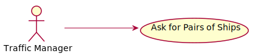
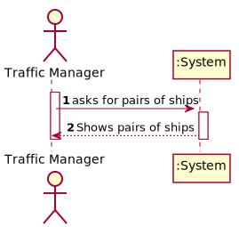
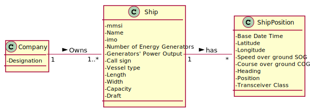
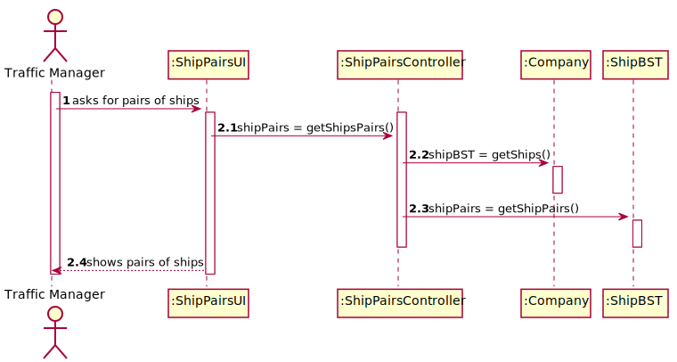
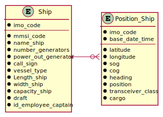
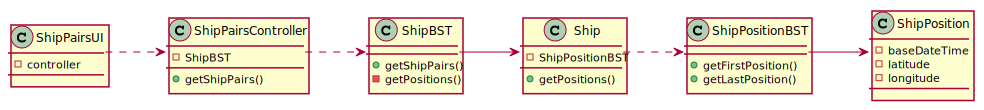

# US 107 - Pairs of Ships

## 1. Requirements Engineering

### 1.1. User Story Description

Return pairs of ships with routes with close departure/arrival coordinates (no more than 5 Kms away) and with different Travelled Distance.

### 1.2. Acceptance Criteria

* **AC1:** Sorted by the mmsi code of the 1st ship and in descending order of the Travelled Distance difference.
* **AC2:** Do not consider ships with Travelled Distance less than 10 kms.

### 1.3 Input and Output Data

**Input Data:**

* Typed data:
	* none

* Selected data:
    * none

**Output Data:**

* pairs of ships

### 1.4 Use Case Diagram (UCD)

### 1.5 System Sequence Diagram (SSD)

### 1.6 Other Relevant Remarks

none

## 2. OO Analysis

### 2.1. Relevant Domain Model Excerpt 

### 2.2. Other Remarks

none

## 3. Design - User Story Realization 

## 3.1. Sequence Diagram (SD)

## 3.2. Relational Model (RM)

## 3.3. Class Diagram (CD)

# 4. Tests 

        @Test
        void ShipPairsTest() {
            ArrayList<Ship[]> expected = new ArrayList<>();
            ArrayList<Ship[]> actual;
    
            ShipPosition pos1 = new ShipPosition(LocalDateTime.of(2020, 12, 31, 17, 0), 42.97800,-66.96500,12.9,13.1,355, 'B', 0);
            ShipPosition pos2 = new ShipPosition(LocalDateTime.of(2020, 12, 31, 17, 30), 60.97900,-65.97050,12.9,13.1,355, 'B', 0);
    
            ShipPosition pos3 = new ShipPosition(LocalDateTime.of(2020, 12, 31, 16, 20), 30.97870,-30.97000,12.9,13.1,355, 'B', 0);
            ShipPosition pos4 = new ShipPosition(LocalDateTime.of(2020, 12, 31, 17, 16), 50.97880,-50.97000,12.9,13.1,355, 'B', 0);
    
            ShipPosition pos5 = new ShipPosition(LocalDateTime.of(2020, 12, 31, 17, 19), 42.97875,-66.97001,12.9,13.1,355, 'B', 0);
            ShipPosition pos6 = new ShipPosition(LocalDateTime.of(2020, 12, 31, 18, 3), 60.97900,-65.97020,12.9,13.1,355, 'B', 0);
    
            ShipPosition pos7 = new ShipPosition(LocalDateTime.of(2020, 12, 31, 16, 20), 30.97875,-30.97001,12.9,13.1,355, 'B', 0);
            ShipPosition pos8 = new ShipPosition(LocalDateTime.of(2020, 12, 31, 17, 16), 50.97890,-50.97010,12.9,13.1,355, 'B', 0);
    
            ship1.addPosition(pos1);
            ship1.addPosition(pos2);
            ship2.addPosition(pos3);
            ship2.addPosition(pos4);
            ship3.addPosition(pos5);
            ship3.addPosition(pos6);
            ship4.addPosition(pos7);
            ship4.addPosition(pos8);
    
            expected.add(new Ship[2]);
            expected.get(0)[0] = ship2;
            expected.get(0)[1] = ship4;
    
            expected.add(new Ship[2]);
            expected.get(1)[0] = ship1;
            expected.get(1)[1] = ship3;
    
            actual = shipBST.getShipPairs();
    
            assertSame(expected.get(0)[0], actual.get(0)[0]);
            assertSame(expected.get(0)[1], actual.get(0)[1]);
            assertSame(expected.get(1)[0], actual.get(1)[0]);
            assertSame(expected.get(1)[1], actual.get(1)[1]);
        }

    @Test
    public void getFirstPositionTest() {
        Ship ship = new Ship("210950000","name1","IMO9395044",10,70,"C4SQ2",60,166,25,100,(float) 9.5);
        ShipPosition position1 = new ShipPosition(LocalDateTime.of(2020,12,24,9,10), 42.97875,66.97001,12.9,13.1,355,'B', 0);
        ShipPosition position2 = new ShipPosition(LocalDateTime.of(2020,12,24,10,20), 42.97875,66.97001,12.9,13.1,355,'B', 0);
        ShipPosition position3 = new ShipPosition(LocalDateTime.of(2020,12,24,11,30), 42.97875,66.97001,12.9,13.1,355,'B', 0);
        ShipPosition position4 = new ShipPosition(LocalDateTime.of(2020,12,24,12,40), 42.97875,66.97001,12.9,13.1,355,'B', 0);
        ShipPosition position5 = new ShipPosition(LocalDateTime.of(2020,12,24,13,50), 42.97875,66.97001,12.9,13.1,355,'B', 0);

        ship.addPosition(position5);
        ship.addPosition(position2);
        ship.addPosition(position4);
        ship.addPosition(position1);
        ship.addPosition(position3);

        ShipPosition expected = position1;
        ShipPosition actual = ship.getPosition().getFirstPosition();

        assertSame(expected, actual);
    }

# 5. Construction (Implementation)

## Class ShipBST

    public ArrayList<Ship[]> getShipPairs() {
        ArrayList<Ship[]> res = new ArrayList<>();
        TreeMap<Ship, Double> travelledDistances = new TreeMap<>();
        TreeMap<Ship, ShipPosition> startPositions = new TreeMap<>();
        TreeMap<Ship, ShipPosition> endPositions = new TreeMap<>();
        Ship[] ships;
        int index;

        getPositions(startPositions, endPositions, root);

        ships = startPositions.keySet().toArray(new Ship[0]);

        for (Ship ship : ships)
           travelledDistances.put(ship, ship.getPosition().travelledDistance());

        for (int i = 0; i < ships.length; i++) {
            for (int j = i+1; j < ships.length; j++) {
                if (Utils.distanceBetweenTwoCoordinates(startPositions.get(ships[i]), startPositions.get(ships[j])) <= 5000 &&
                    Utils.distanceBetweenTwoCoordinates(endPositions.get(ships[i]), endPositions.get(ships[j])) <= 5000 ) {

                    index = res.size();
                    while (index > 0 &&
                            Math.abs(travelledDistances.get(ships[i]) - travelledDistances.get(ships[j])) <
                            Math.abs(travelledDistances.get(res.get(index-1)[0]) - travelledDistances.get(res.get(index-1)[1])))
                        index--;

                    if (ships[i].getMMSI().compareTo(ships[j].getMMSI()) < 0)
                        res.add(index, new Ship[] {ships[i], ships[j]});
                    else
                        res.add(index, new Ship[] {ships[j], ships[i]});
                }
            }
        }
        return res;
    }

    private void getPositions(TreeMap<Ship, ShipPosition> startMap, TreeMap<Ship, ShipPosition> endMap, Node<Ship> node) {
        if (node != null) {
            getPositions(startMap, endMap, node.getLeft());
            Ship ship = node.getElement();
            if (ship.getPosition().travelledDistance() >= 10) {
                startMap.put(ship, ship.getPosition().getFirstPosition());
                endMap.put(ship, ship.getPosition().getLastPosition());
            }
            getPositions(startMap, endMap, node.getRight());
        }
    }

# 6. Integration and Demo 

* Added a new option to the traffic manager menu.

# 7. Observations

none