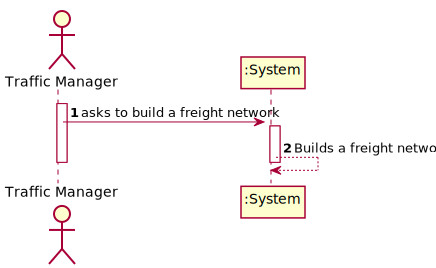
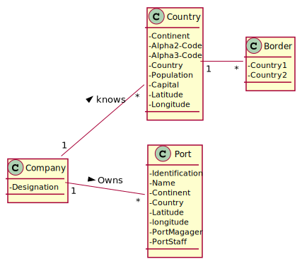
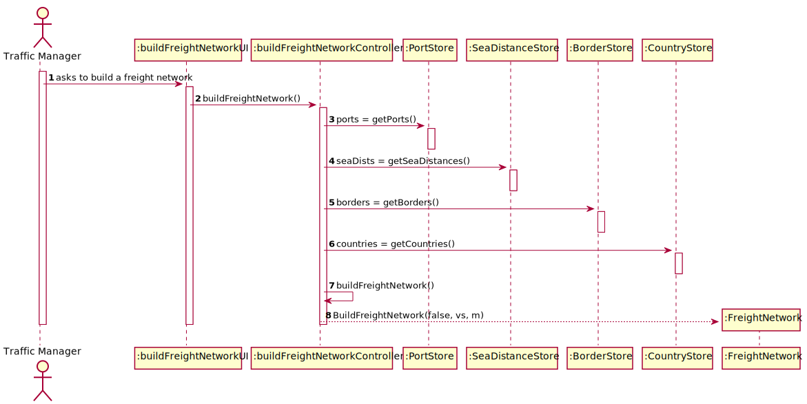
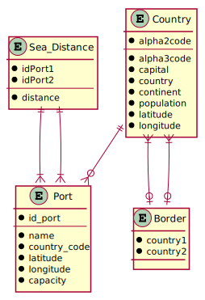
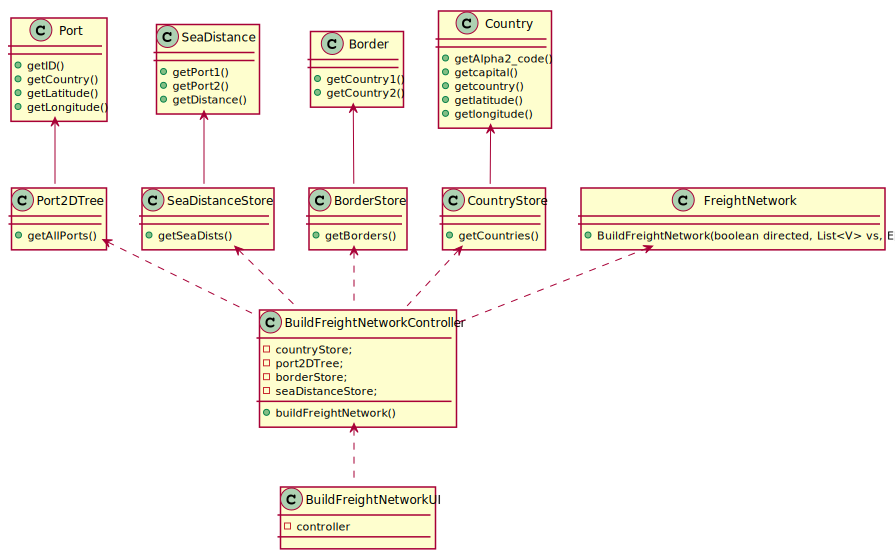

# US 301 - Freight Network

## 1. Requirements Engineering

### 1.1. User Story Description

As a Traffic manager, I which to import data from countries, ports, borders and seadists files from the database to build a freight network.

### 1.2. Acceptance Criteria

* **AC1:** The capital of a country has a direct connection with the capitals of the countries with which it borders. The ports of a country, besides connecting with all the ports of the same country, the port closest to the capital of the country connects with it; and finally, each port of a country connects with the n closest ports of any other country.

* **AC2:** The calculation of distances in Kms between capitals, and ports and capitals must be done using the GPS coordinates.

* **AC3:** The graph must be implemented using the adjacency matrix representation and ensuring the indistinct manipulation of capitals and seaports

### 1.3 Input and Output Data

**Input Data:**

* Typed data:
	* none

* Selected data:
    * none

**Output Data:**

* none

### 1.4. Use Case Diagram (UCD)

### 1.5. System Sequence Diagram (SSD)

### 1.6 Other Relevant Remarks

none

## 2. OO Analysis

### 2.1. Relevant Domain Model Excerpt 

### 2.2. Other Remarks

none

## 3. Design - User Story Realization 

## 3.1. Sequence Diagram (SD)

## 3.2. Relational Model (RM)

## 3.3. Class Diagram (CD)

# 4. Tests 

    

# 5. Construction (Implementation)

## Class 

# 6. Integration and Demo 

* 