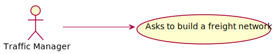

# US 301 - Freight Network

## 1. Requirements Engineering

### 1.1. User Story Description

As a Traffic manager, I which to import data from countries, ports, borders and seadists files from the database to build a freight network.

### 1.2. Acceptance Criteria

* **AC1:** The capital of a country has a direct connection with the capitals of the countries with which it borders. The ports of a country, besides connecting with all the ports of the same country, the port closest to the capital of the country connects with it; and finally, each port of a country connects with the n closest ports of any other country.

* **AC2:** The calculation of distances in Kms between capitals, and ports and capitals must be done using the GPS coordinates.

* **AC3:** The graph must be implemented using the adjacency matrix representation and ensuring the indistinct manipulation of capitals and seaports

### 1.3 Input and Output Data

**Input Data:**

* Typed data:
	* none

* Selected data:
    * none

**Output Data:**

* none

### 1.4. Use Case Diagram (UCD)

### 1.5. System Sequence Diagram (SSD)

### 1.6 Other Relevant Remarks

none

## 2. OO Analysis

### 2.1. Relevant Domain Model Excerpt 

### 2.2. Other Remarks

none

## 3. Design - User Story Realization 

## 3.1. Sequence Diagram (SD)

## 3.2. Relational Model (RM)

## 3.3. Class Diagram (CD)

# 4. Tests 

        @Test
        void buildFreightNetwork1() {
            BuildFreightNetworkController controller = new BuildFreightNetworkController();
            ArrayList<String> vs = new ArrayList<>();
            vs.add(country1.getCapital());
            vs.add(country2.getCapital());
            vs.add(port1.getName());
            vs.add(port2.getName());
            vs.add(port3.getName());
            vs.add(port4.getName());
            Integer[][] m = new Integer[vs.size()][vs.size()];
            m[0][1] = (int) distanceBetweenTwoCoordinates(country1.getLongitude(), country1.getLatitude(), country2.getLongitude(), country2.getLatitude());
            m[1][0] = m[0][1];
            m[2][3] = seaDistance5.getDistance();
            m[3][2] = m[2][3];
            m[4][5] = seaDistance6.getDistance();
            m[5][4] = m [4][5];
            m[0][2] = (int) distanceBetweenTwoCoordinates(country1.getLongitude(), country1.getLatitude(), port1.getLongitude(), port1.getLatitude());
            m[2][0] = m [0][2];
            m[1][5] = (int) distanceBetweenTwoCoordinates(country2.getLongitude(), country2.getLatitude(), port4.getLongitude(), port4.getLatitude());
            m[5][1] = m [1][5];
            m[2][4] = seaDistance1.getDistance();
            m[4][2] = m [2][4];
            m[3][4] = seaDistance2.getDistance();
            m[4][3] = m [3][4];
            m[3][5] = seaDistance3.getDistance();
            m[5][3] = m [3][5];
    
            FreightNetwork actual = controller.BuildFreightNetwork(countries, ports, borders, seaDistances, 1);
            FreightNetwork expected = new FreightNetwork(vs, m);
            assertEquals(expected, actual);
        }

# 5. Construction (Implementation)

## Class BuildFreightNetworkController

    private final CountryStore countryStore;
    private final Port2DTree port2DTree;
    private final BorderStore borderStore;
    private final SeaDistanceStore seaDistanceStore;

    public BuildFreightNetworkController() {
        Company company = App.getInstance().getCompany();
        countryStore = company.getCountryStore();
        port2DTree = company.getPorts();
        borderStore = company.getBorderStore();
        seaDistanceStore = company.getSeadistanceStore();
    }

    public void BuildFreightNetwork() {
        try {
            countryStore.refresh();
            port2DTree.loadPortsFromDatabase();
            borderStore.refresh();
            seaDistanceStore.refresh();

            App.getInstance().getCompany().setFreightNetwork(BuildFreightNetwork(
                            countryStore.getCountries(),
                            (ArrayList<Port>) port2DTree.getAllPorts(),
                            borderStore.getBorders(),
                            seaDistanceStore.getSeadists(),
                        1));
        } catch (SQLException e) {
            e.printStackTrace();
        }
    }

    public FreightNetwork BuildFreightNetwork(ArrayList<Country> countries, ArrayList<Port> ports, ArrayList<Border> borders, ArrayList<SeaDistance> seaDistances, int n) {
        ArrayList<String> vs = new ArrayList<>();
        Integer[][] m;
        int index1;
        int index2;
        int distance;
        int closestDistance;
        Port closestPort;
        ArrayList<Port> closestPorts = new ArrayList<>();
        ArrayList<Integer> closestDistances = new ArrayList<>();
        int index;

        for (Country country : countries) {
            vs.add(country.getCapital());
        }

        for (Port port : ports) {
            vs.add(port.getName());
        }

        m = new Integer[vs.size()][vs.size()];

        // The capital of a country has a direct connection with the capitals of the countries with which it borders
        for (Border border : borders) {
            Country country1 = border.getCountry1();
            Country country2 = border.getCountry2();
            index1 = countries.indexOf(country1);
            index2 = countries.indexOf(country2);
            distance = (int) distanceBetweenTwoCoordinates(country1.getLongitude(), country1.getLatitude(), country2.getLongitude(), country2.getLatitude());
            m[index1][index2] = distance;
            m[index2][index1] = distance;
        }

        // The ports of a country connect with all the ports of the same country
        for (int i = 0; i < ports.size()-1; i++) {
            for (int j = i+1; j < ports.size(); j++) {
                Port port1 = ports.get(i);
                Port port2 = ports.get(j);
                if (port1.getCountry().equals(port2.getCountry())) {
                    index1 = countries.size() + i;
                    index2 = countries.size() + j;
                    int g = 0;
                    distance = -1;
                    while (g < seaDistances.size() && distance == -1) {
                        if (seaDistances.get(g).getId_port1() == port1.getID() && seaDistances.get(g).getId_port2() == port2.getID() || seaDistances.get(g).getId_port1() == port2.getID() && seaDistances.get(g).getId_port2() == port1.getID())
                            distance = seaDistances.get(g).getDistance();
                        g++;
                    }
                    if (distance != -1) {
                        m[index1][index2] = distance;
                        m[index2][index1] = distance;
                    }
                }
            }
        }

        // the port closest to the capital of the country connects with it
        for (Country country : countries) {
            closestDistance = Integer.MAX_VALUE;
            closestPort = null;
            for (Port port : ports) {
                if (port.getCountry().equals(country.getAlpha2_code())) {
                    distance = (int) distanceBetweenTwoCoordinates(port.getLongitude(), port.getLatitude(), country.getLongitude(), country.getLatitude());
                    if (distanceBetweenTwoCoordinates(port.getLongitude(), port.getLatitude(), country.getLongitude(), country.getLatitude()) < closestDistance) {
                        closestPort = port;
                        closestDistance = distance;
                    }
                }
            }
            index1 = countries.size()+ports.indexOf(closestPort);
            index2 = countries.indexOf(country);
            m[index1][index2] = closestDistance;
            m[index2][index2] = closestDistance;
        }

        //each port of a country connects with the n closest ports of any other country
        if (n > 0) {
            for (Port port1 : ports) {
                for (Country country : countries) {
                    if (!port1.getCountry().equals(country.getAlpha2_code())) {
                        for (Port port2 : ports) {
                            if (port2.getCountry().equals(country.getAlpha2_code()) && port2.getID() != port1.getID()) {
                                int i = 0;
                                distance = -1;
                                while (i < seaDistances.size() && distance == -1) {
                                    if (seaDistances.get(i).getId_port1() == port1.getID() && seaDistances.get(i).getId_port2() == port2.getID() || seaDistances.get(i).getId_port1() == port2.getID() && seaDistances.get(i).getId_port2() == port1.getID())
                                        distance = seaDistances.get(i).getDistance();
                                    i++;
                                }
                                if (distance != -1) {
                                    index = closestPorts.size();
                                    while (index >= 1 && distance < closestDistances.get(index - 1)) {
                                        index--;
                                    }
                                    closestDistances.add(index, distance);
                                    closestPorts.add(index, port2);
                                    if (closestPorts.size() > n) {
                                        closestPorts.remove(closestPorts.size() - 1);
                                        closestDistances.remove(closestDistances.size() - 1);
                                    }
                                }
                            }
                        }
                        for (int i = 0; i < closestPorts.size(); i++) {
                            index1 = countries.size() + ports.indexOf(port1);
                            index2 = countries.size() + ports.indexOf(closestPorts.get(i));
                            distance = closestDistances.get(i);
                            m[index1][index2] = distance;
                            m[index2][index1] = distance;
                        }
                        closestPorts.clear();
                        closestDistances.clear();
                    }
                }
            }
        }
        return new FreightNetwork(vs, m);
    }

# 6. Integration and Demo 

* Added a new option on the Traffic Manager Menu.