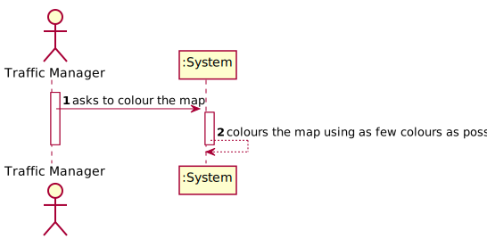

# US 302 - Colour the Map

## 1. Requirements Engineering

### 1.1. User Story Description

As a Traffic manager, I which to colour the map using as few colours as possible.

### 1.2. Acceptance Criteria

* **AC1:** Neighbouring countries must not share the same colour.

### 1.3 Input and Output Data

**Input Data:**

* Typed data:
    * none

* Selected data:
    * none

**Output Data:**

* Map associated with colours.

### 1.4. Use Case Diagram (UCD)

### 1.5. System Sequence Diagram (SSD)

### 1.6 Other Relevant Remarks

none

## 2. OO Analysis

### 2.1. Relevant Domain Model Excerpt

### 2.2. Other Remarks

none

## 3. Design - User Story Realization

## 3.1. Sequence Diagram (SD)

## 3.2. Relational Model (RM)

## 3.3. Class Diagram (CD)

# 4. Tests

# 5. Construction (Implementation)

## Class BuildFreightNetworkController

    public class ColourMapController {
    public int calculateNumberOfColours(Graph grafo) {
    if (grafo == null) {
    return 0;
    }
    int max = -1;
    for (Object vertex : grafo.vertices()) {
    int num = grafo.adjVertices(vertex).size();
    if (num > max) {
    max = num;
    }
    }
    return max;
    }
    public<V, E> Map<V, Integer> colourMap (Graph<V, E> grafo){
    int numberOfColours = calculateNumberOfColours(grafo);
    Map<V, Integer> map = new HashMap<>();
    for (V vertex : grafo.vertices()) {
    List<V> l = new ArrayList<>(grafo.adjVertices(vertex));
    int colour = atributeColour(l,map,numberOfColours);
    map.put(vertex,colour);
    }
    return map;
    }

    //O(E+A) , O(n^2)
    public <V> int atributeColour(List<V> l, Map<V, Integer> map, int numberOfColours) {
        List<Integer> listOfColours = new LinkedList<>();
        for (int i = 0; i < numberOfColours; i++) {
            listOfColours.add(i);
        }
        for (V vertex : l ) {
            if(map.containsKey(vertex)){
                listOfColours.remove(map.get(vertex));
            }
        }
        return listOfColours.get(0);
    }

# 6. Integration and Demo

* Added a new option on the Traffic Manager Menu.