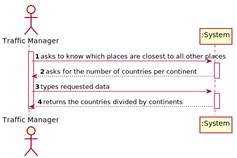
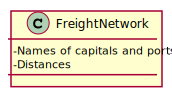
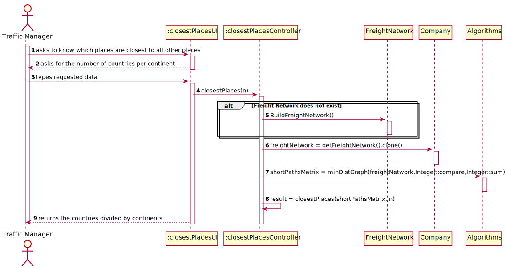
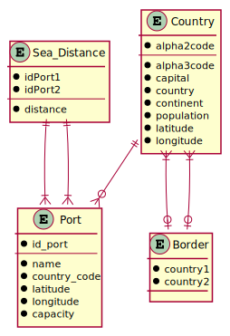
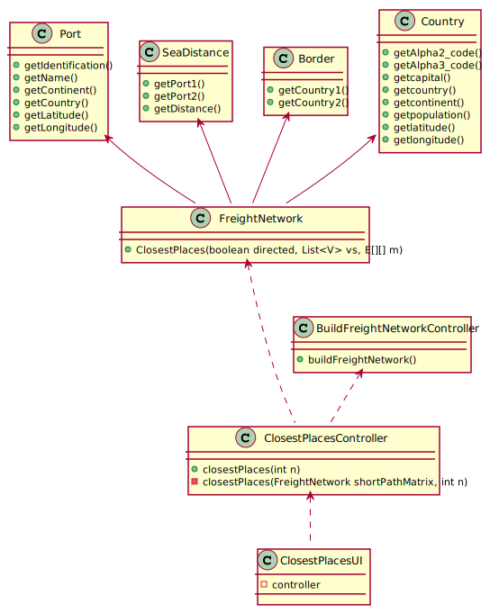

# US 303 - Know which places are closest to all other places

## 1. Requirements Engineering

### 1.1. User Story Description

As a Traffic manager, I wish to know which places (cities or ports) are closest to all other places (closeness places).

### 1.2. Acceptance Criteria

* **AC1:** Return the n closeness locals by continent.

* **AC2:** The measure of proximity is calculated as the average of the shortest path length from the local to all other locals in the network.

### 1.3. Found out Dependencies
* There is a dependency with US301:"Build Freight Network", since the program needs the data to calculate the distance between ports, between capitals and between both. 

### 1.4 Input and Output Data

**Input Data:**

* Typed data:
	* Number of countries per continent

* Selected data:
    * none

**Output Data:**

* none

### 1.5. Use Case Diagram (UCD)

### 1.6. System Sequence Diagram (SSD)

### 1.7 Other Relevant Remarks

none

## 2. OO Analysis

### 2.1. Relevant Domain Model Excerpt 

### 2.2. Other Remarks

none

## 3. Design - User Story Realization 

## 3.1. Sequence Diagram (SD)

## 3.2. Relational Model (RM)

## 3.3. Class Diagram (CD)

