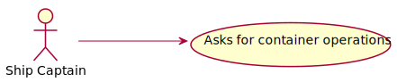
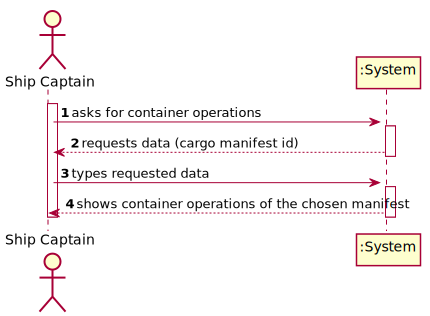
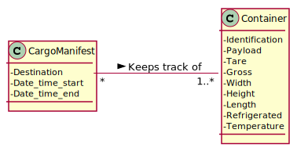
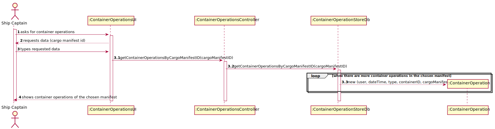
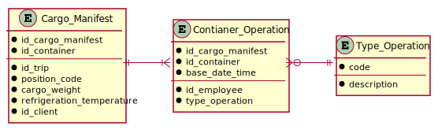
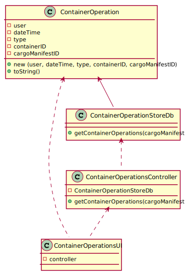

# US 304 - Container Operations

## 1. Requirements Engineering

### 1.1. User Story Description

 As Ship Captain, I want to have access to audit trails for a given container of a given cargo manifest, that is, I want to have access to a list of all operations performed on a given container of a given manifest, in chronological order. For each operation I want to know: the user/login that performed it, the date and time the operation was performed, the type of operation (INSERT, UPDATE, DELETE), the container identifier and the cargo manifest identifier.

### 1.2. Acceptance Criteria

* **AC1:** There is a table for recording audit trails, i.e., record all write-operations involving containers of a cargo manifest.

* **AC2:** Proper mechanisms for recording write-operations involving containers of a cargo manifest are implemented (INSERT, UPDATE, DELETE).

* **AC3:** A simple and effective audit trail consultation process is implemented.

### 1.3 Input and Output Data

**Input Data:**

* Typed data:
	* cargo manifest id

* Selected data:
    * none

**Output Data:**

* container operations of the chosen manifest

### 1.4. Use Case Diagram (UCD)

### 1.5. System Sequence Diagram (SSD)

## 2. OO Analysis

### 2.1. Relevant Domain Model Excerpt 

### 2.2. Other Remarks

none

## 3. Design - User Story Realization 

## 3.1. Sequence Diagram (SD)

## 3.2. Relational Model (RM)

## 3.3. Class Diagram (CD)

# 4. Tests 

    

# 5. Construction (Implementation)

## Class 

# 6. Integration and Demo 

* 