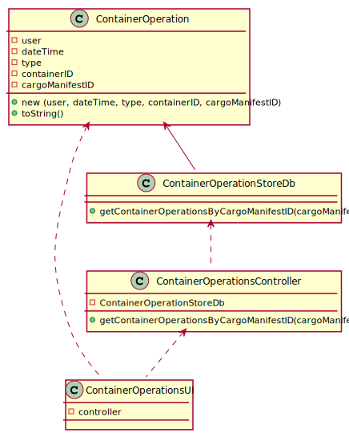

# US 304 - Container Operations

## 1. Requirements Engineering

### 1.1. User Story Description

 As Ship Captain, I want to have access to audit trails for a given container of a given cargo manifest, that is, I want to have access to a list of all operations performed on a given container of a given manifest, in chronological order. For each operation I want to know: the user/login that performed it, the date and time the operation was performed, the type of operation (INSERT, UPDATE, DELETE), the container identifier and the cargo manifest identifier.

### 1.2. Acceptance Criteria

* **AC1:** There is a table for recording audit trails, i.e., record all write-operations involving containers of a cargo manifest.

* **AC2:** Proper mechanisms for recording write-operations involving containers of a cargo manifest are implemented (INSERT, UPDATE, DELETE).

* **AC3:** A simple and effective audit trail consultation process is implemented.

### 1.3 Input and Output Data

**Input Data:**

* Typed data:
	* cargo manifest id

* Selected data:
    * none

**Output Data:**

* container operations of the chosen manifest

### 1.4. Use Case Diagram (UCD)

### 1.5. System Sequence Diagram (SSD)

## 2. OO Analysis

### 2.1. Relevant Domain Model Excerpt 

### 2.2. Other Remarks

none

## 3. Design - User Story Realization 

## 3.1. Sequence Diagram (SD)

## 3.2. Relational Model (RM)

## 3.3. Class Diagram (CD)

# 4. Tests 

**Test 1: Ensure that toString() method of ContainerOperation Class works as intended.**

    @Test
    void testToString() {
        LocalDateTime dateTime = LocalDateTime.of(2021, 11, 14, 10, 20, 30, 482371);
        ContainerOperation containerOperation = new ContainerOperation("user", dateTime, "Update", "BICZ1231235", 12122);

        String expected = "ContainerOperation{user='user', dateTime=" + dateTime + ", type='Update', containerID='BICZ1231235', cargoManifestID='12122'}";

        Assertions.assertEquals(expected, containerOperation.toString());
    }

# 5. Construction (Implementation)

## Trigger

    create or replace trigger Register_Operation AFTER INSERT or UPDATE or DELETE on Cargo_Manifest
    for each row
    
    BEGIN
    
        IF INSERTING THEN
            INSERT INTO Container_Operation VALUES(:new.id_cargo_manifest, :new.id_container, LOCALTIMESTAMP, 'I', USER);
        ELSIF UPDATING THEN
            INSERT INTO Container_Operation VALUES(:old.id_cargo_manifest, :old.id_container, LOCALTIMESTAMP, 'U', USER);
        ELSE
            INSERT INTO Container_Operation VALUES(:old.id_cargo_manifest, :old.id_container, LOCALTIMESTAMP, 'D', USER);
        END IF;
    
    END;

## Class ContainerOperationStoreDb

    public ArrayList<ContainerOperation> getContainerOperationsByCargoManifestID(int cargoManifestID) {
        ArrayList<ContainerOperation> containerOperations = new ArrayList<>();
        Connection connection = App.getInstance().getSql().getDatabaseConnection().getConnection();

        // get container operations of the chosen Cargo Manifest
        String sqlCommand = "select * from Container_Operation where id_cargo_manifest = ?";
        try (PreparedStatement containerOperationsPreparedStatement = connection.prepareStatement(sqlCommand)) {
            containerOperationsPreparedStatement.setInt(1, cargoManifestID);
            try (ResultSet containerOperationsResultSet = containerOperationsPreparedStatement.executeQuery()) {

                while (containerOperationsResultSet.next()) {

                    // get the type of operation based on its code
                    sqlCommand = "select description from Type_Operation where code = ?";
                    try (PreparedStatement operationTypePreparedStatement = connection.prepareStatement(sqlCommand)) {
                        operationTypePreparedStatement.setString(1, containerOperationsResultSet.getString("type_operation"));
                        try (ResultSet operationTypeResultSet = operationTypePreparedStatement.executeQuery()) {
                            if (operationTypeResultSet.next()) {
                                String operationType = operationTypeResultSet.getString("description");

                                // create Container Operation and add it to the result list
                                containerOperations.add(new ContainerOperation(containerOperationsResultSet.getString("employee"),
                                        containerOperationsResultSet.getTimestamp("base_date_time").toLocalDateTime(),
                                        operationType,
                                        containerOperationsResultSet.getString("id_container"),
                                        cargoManifestID));
                            }
                        }
                    }
                }
            }
        } catch (SQLException throwables) {
            throwables.printStackTrace();
        }
        return containerOperations;
    }

# 6. Integration and Demo 

* Created a menu for Ship Captains.