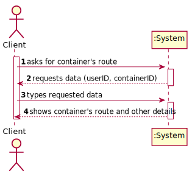
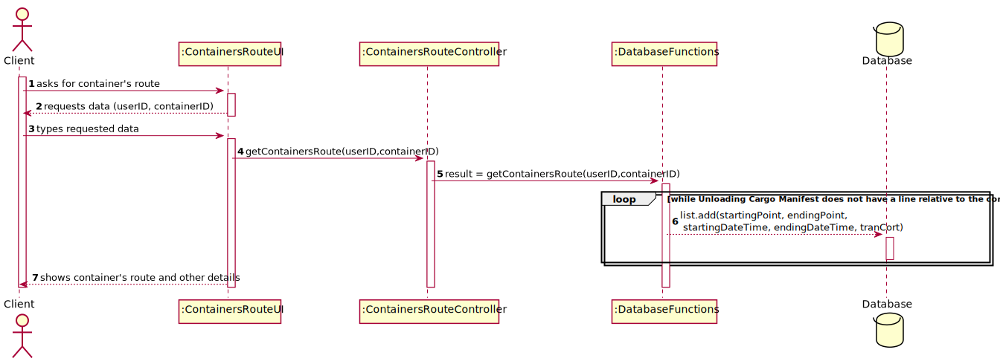
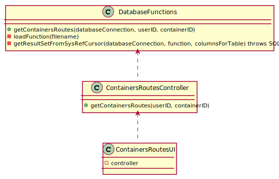

# US 305 - Route of a specific container

## 1. Requirements Engineering

### 1.1. User Story Description

As Client, I want to know the route of a specific container I am leasing.

### 1.2. Acceptance Criteria

* **AC1:** Users provide their registration code, the container identifier and get its
           path, from source to current location indicating time of arrival and
           departure at each location and mean of transport (ship or truck) between
           each pair of locations

* **AC2:** When the provided identifier is not valid or, being valid, is not leased by
           the client, a warning is returned.

### 1.3 Input and Output Data

**Input Data:**

* Typed data:
	* registration code
	* container identifier

* Selected data:
    * none

**Output Data:**

* container's path and other details

### 1.4. Use Case Diagram (UCD)

### 1.5. System Sequence Diagram (SSD)

## 2. OO Analysis

### 2.1. Relevant Domain Model Excerpt 

### 2.2. Other Remarks

none

## 3. Design - User Story Realization 

## 3.1. Sequence Diagram (SD)

## 3.2. Relational Model (RM)

## 3.3. Class Diagram (CD)

