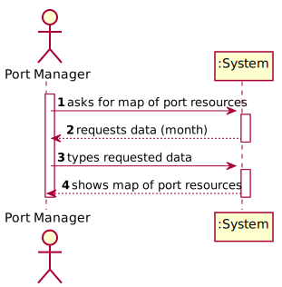
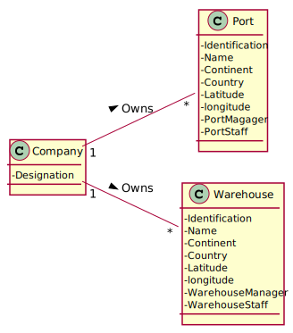
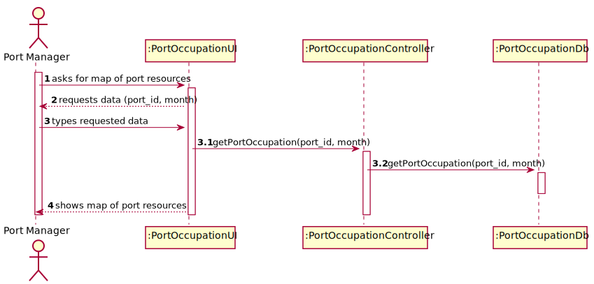
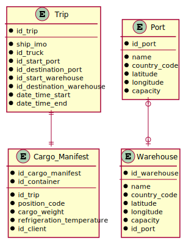
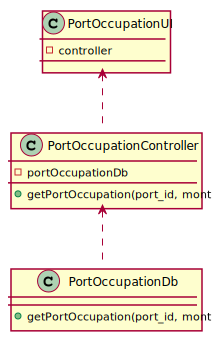

# US 310 - Map of Port Resources  

## 1. Requirements Engineering

### 1.1. User Story Description

As Port manager, I intend to have a map of the occupation of the existing resources in the port during a given month. 

### 1.2. Acceptance Criteria

* **AC1:** Occupation of resources is restricted to the month provided.

* **AC2:** The reported occupation respects actual port capacity.

### 1.3 Input and Output Data

**Input Data:**

* Typed data:
	* month

* Selected data:
    * none

**Output Data:**

* map of the occupation of the existing resources in the port during the given month

### 1.4. Use Case Diagram (UCD)

### 1.5. System Sequence Diagram (SSD)

## 2. OO Analysis

### 2.1. Relevant Domain Model Excerpt 

### 2.2. Other Remarks

none

## 3. Design - User Story Realization 

## 3.1. Sequence Diagram (SD)

## 3.2. Relational Model (RM)

## 3.3. Class Diagram (CD)

# 4. Tests 

# 5. Construction (Implementation)

## PL/SQL function

    CREATE OR REPLACE FUNCTION portOccupation(portId Port.id_port%type, selectedDate timestamp) RETURN varchar 
    is
    
    warehouseId integer;
    portCapacity integer;
    warehouseCapacity integer;
    tripId integer;
    portSlots integer := 0;
    warehouseSlots integer := 0;
    cargoManifestId integer;
    containerAmount integer;
    occupationReport varchar(100);
    
    cursor fromTrips is 
    select id_trip
    from Trip
    where id_start_port = portId and
    (EXTRACT(year FROM date_time_start) = EXTRACT(year FROM selectedDate) and EXTRACT(month FROM date_time_start) = EXTRACT(month FROM selectedDate));
    
    cursor toTrips is 
    select id_trip
    from Trip
    where id_destination_port = portId and 
    (EXTRACT(year FROM date_time_end) = EXTRACT(year FROM selectedDate) and EXTRACT(month FROM date_time_end) = EXTRACT(month FROM selectedDate));
    
    
    BEGIN 
    
    select capacity into portCapacity
    from Port
    where id_port = portId;
    
    select id_warehouse into warehouseId
    from Warehouse
    where id_port = portId;
    
    select capacity into warehouseCapacity
    from Warehouse
    where id_warehouse = warehouseId;
    
    
    open fromTrips;
    LOOP
        FETCH fromTrips into tripId; 
        EXIT WHEN fromTrips%notfound;
        
        portSlots := portSlots - 1;
        
        select count(*) into containerAmount
        from Cargo_Manifest
        where id_trip = tripId;
        
        warehouseSlots := warehouseSlots - containerAmount;
        
    END LOOP; 
    CLOSE fromTrips;
    
    
    open toTrips;
    LOOP
        FETCH toTrips into tripId; 
        EXIT WHEN toTrips%notfound;
        
        portSlots := portSlots + 1;
        
        select count(*) into containerAmount
        from Cargo_Manifest
        where id_trip = tripId;
        
        warehouseSlots := warehouseSlots + containerAmount;
        
    END LOOP; 
    CLOSE toTrips;
    
    occupationReport := 'This month, port capacity changed by ' || (ROUND(portSlots/portCapacity * 100, 2)) || '% and warehouse capacity changed by ' || (ROUND(warehouseSlots/warehouseCapacity * 100, 2)) || '%.';
    
    return occupationReport;
    
    END;

## Class PortOccupationDb

    public String getPortOccupation(String portID, String month) {
        Connection connection = App.getInstance().getSql().getDatabaseConnection().getConnection();
        String report = "An error occurred";

        String sqlCommand = "SELECT portOccupation(?, TO_DATE(?,'YYYY-MM')) from dual";
        try (PreparedStatement portOccupationPreparedStatement = connection.prepareStatement(sqlCommand)) {
            portOccupationPreparedStatement.setString(1, portID);
            portOccupationPreparedStatement.setString(2, month);
            try (ResultSet portOccupationResultSet = portOccupationPreparedStatement.executeQuery()) {
                portOccupationResultSet.next();
                report = portOccupationResultSet.getString(1);
            }
        } catch (SQLException throwables) {
            throwables.printStackTrace();
        }
        return report;
    }

# 6. Integration and Demo 

* A new option was added to the Port Manager menu.