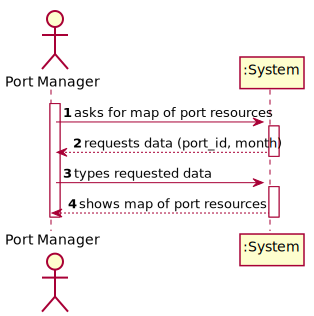

# US 310 - Map of Port Resources  

## 1. Requirements Engineering

### 1.1. User Story Description

As Port manager, I intend to have a map of the occupation of the existing resources in the port during a given month. 

### 1.2. Acceptance Criteria

* **AC1:** Occupation of resources is restricted to the month provided.

* **AC2:** The reported occupation respects actual port capacity.

### 1.3 Input and Output Data

**Input Data:**

* Typed data:
	* month

* Selected data:
    * none

**Output Data:**

* map of the occupation of the existing resources in the port during the given month

### 1.4. Use Case Diagram (UCD)

### 1.5. System Sequence Diagram (SSD)

## 2. OO Analysis

### 2.1. Relevant Domain Model Excerpt 

### 2.2. Other Remarks

none

## 3. Design - User Story Realization 

## 3.1. Sequence Diagram (SD)

## 3.2. Relational Model (RM)

## 3.3. Class Diagram (CD)

# 4. Tests 

    

# 5. Construction (Implementation)

## Class 

# 6. Integration and Demo 

* 