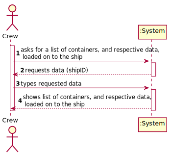
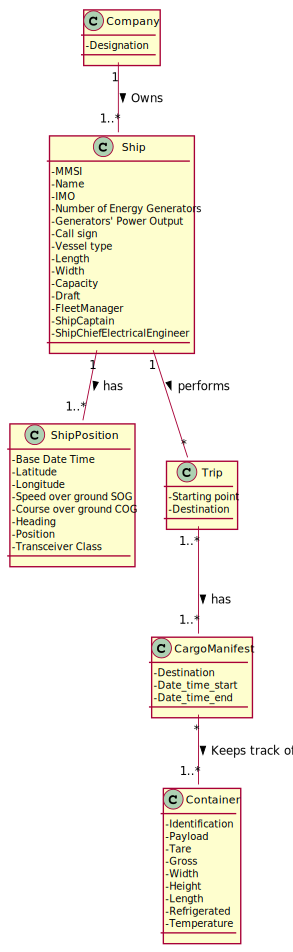
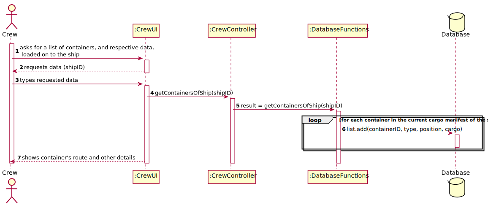
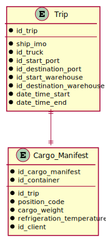
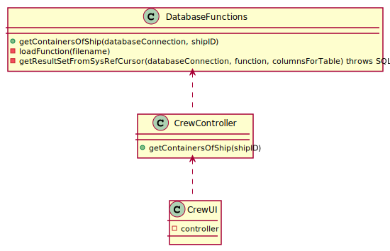

# US 311 - Database access exclusively to the information of the containers that are loaded on the ship

## 1. Requirements Engineering

### 1.1. User Story Description

As Ship Captain, I want to provide a database access account, with login “crew@lei.pt”
and password “bd7wd5aF”, which gives access exclusively to the information of the
containers that are loaded on my ship. The information about each container to be made
available is: identifier, type, position and load.

### 1.2. Acceptance Criteria

* **AC1:** The user account is created.

* **AC2:** Only the required permissions are granted.

* **AC3:** Only the containers loaded at the Captain's ship are available for consultation.  

* **AC4:**  Only the described  data is publicly available through this "crew" account.

### 1.3 Input and Output Data

**Input Data:**

* Typed data:
    * shipID

* Selected data:
    * none

**Output Data:**

* list of containers, and respective data, loaded on to the ship 

### 1.4. Use Case Diagram (UCD)

### 1.5. System Sequence Diagram (SSD)

## 2. OO Analysis

### 2.1. Relevant Domain Model Excerpt 

### 2.2. Other Remarks

none

## 3. Design - User Story Realization 

## 3.1. Sequence Diagram (SD)

## 3.2. Relational Model (RM)

## 3.3. Class Diagram (CD)

