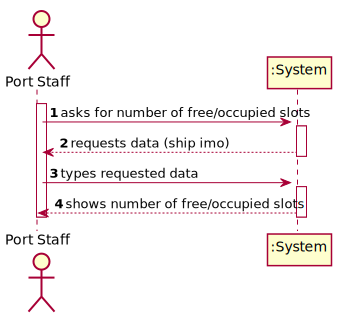
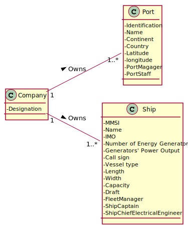

# US 314 - number of free/occupied slots

## 1. Requirements Engineering

### 1.1. User Story Description

As a Port staff, I wish to know the total number of free/occupied slots in the transport vehicle.

### 1.2. Acceptance Criteria

* **AC1:** The number of free/occupied slots should be determined by an Assembly function that traverses the matrix filled with the containers’ IDs.

* **AC2:** The function should return an eight-byte value, where the number of free slots is placed in the four most significant bytes and the number of occupied slots in the four least significant bytes.

### 1.3 Input and Output Data

**Input Data:**

* Typed data:
	* ship imo code

* Selected data:
    * none

**Output Data:**

* number of free/occupied slots

### 1.4. Use Case Diagram (UCD)

### 1.5. System Sequence Diagram (SSD)

## 2. OO Analysis

### 2.1. Relevant Domain Model Excerpt 

### 2.2. Other Remarks

none

## 3. Design - User Story Realization 

## 3.1. Sequence Diagram (SD)

## 3.2. Relational Model (RM)

## 3.3. Class Diagram (CD)

# 4. Tests 

    

# 5. Construction (Implementation)

## Class 

# 6. Integration and Demo 

* 