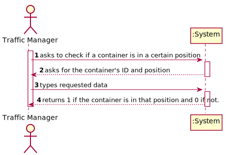
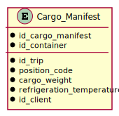

# US 315 - Check if a container is in a certain position

## 1. Requirements Engineering

### 1.1. User Story Description

As a Port staff, given a position in the transport vehicle, I wish to know if a container is there or not.

### 1.2. Customer Specifications and Clarifications 

**From the specifications document:**

> Containers can be transported by land or sea. Every ship has the containers according to a threeaxis displacement.

### 1.3. Acceptance Criteria

* **AC1:** The free/occupied position should be determined by an Assembly function that verifies the matrix filled with the containers’ IDs.
* **AC2:** The function should return 1 if a container is there or 0, otherwise.

### 1.4. Found out Dependencies
* There is a dependency with US313:"Fill a statically reserved matrix in memory with each container's ID", since the program needs the data of all positions of the vehicle 

### 1.5 Input and Output Data

**Input Data:**

* Typed data:
	* Containers' ID
	* Its position

* Selected data:
    * none

**Output Data:**

* 1 if the container is in that position and 0 if not.

### 1.6. Use Case Diagram (UCD)

### 1.7. System Sequence Diagram (SSD)

### 1.8 Other Relevant Remarks

none

## 2. Design - User Story Realization 

## 2.1. Relational Model (RM)

