# US319 - Know the thermal resistance, per square meter, of a container with at least three different materials in its walls
## Theory
The thermal flux of any material is calculated using the following equation:

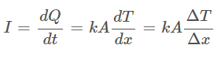

The resistance of any material is calculated using the following equation:

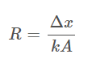

The resistance of a wall with three different materials is calculated using the following equation:
 
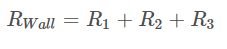

## Container to maintain -5ºC of temperature
The container's walls are composed by three materials:
* 2.5 cm of stainless steel type 304, with 16.2 W/mK of thermal conductivity, as the outer wall
* 5 cm of Polyurethane foam, with 0.03 W/mK of thermal conductivity, as the middle layer
* 2.5 cm of plywood, with 0.13 W/mK of thermal conductivity, as the interior wall

Using the previous equations:

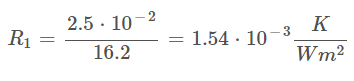

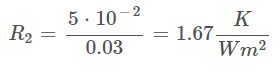

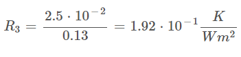

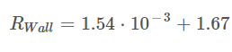
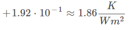

For an outside temperature of 20ºC, the thermal flux is:

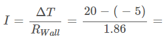
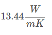

## Container to maintain 7ºC of temperature
The container's walls are composed by three materials:
* 2 cm of Corten Steel type B weather resistant, with 25 W/mK of thermal conductivity, as the outer wall
* 6 cm of Expanded polystyrene, with 0.046 W/mK of thermal conductivity, as the middle layer
* 2 cm Bamboo, with 0.55 W/mK of thermal conductivity, as the interior wall

Using the previous equations:

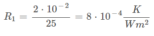

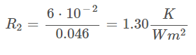

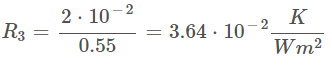

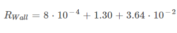
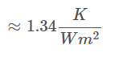

For an outside temperature of 20ºC, the thermal flux is:

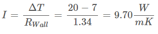
