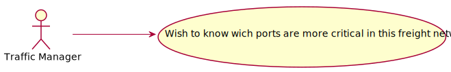
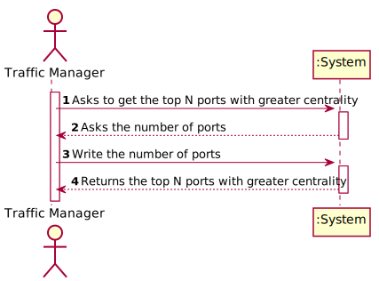

# US 401 - Colour the Map

## 1. Requirements Engineering

### 1.1. User Story Description

As a Traffic manager I wish to know which ports are more critical (have greater centrality) in this freight network.

### 1.2. Acceptance Criteria

* **AC1:** Return the n ports with greater centrality.
* **AC2:** The centrality of a port is defined by the number of shortest paths that pass through it.

### 1.3 Input and Output Data

**Input Data:**

* Typed data:
    * N ports

* Selected data:
    * none

**Output Data:**

* N ports with greater centrality.

### 1.4. Use Case Diagram (UCD)

### 1.5. System Sequence Diagram (SSD)

### 1.6 Other Relevant Remarks

none

## 2. OO Analysis

### 2.1. Relevant Domain Model Excerpt

### 2.2. Other Remarks

none

## 3. Design - User Story Realization

## 3.1. Sequence Diagram (SD)

## 3.2. Relational Model (RM)

## 3.3. Class Diagram (CD)

# 4. Tests

# 5. Construction (Implementation)

## Class CriticalPortsController

    public class CriticalPortsController implements Comparator<Pair<Integer, Port>> {
    private ShortestPathController ctrl;

    public CriticalPortsController(ShortestPathController ctrl){
        this.ctrl = ctrl;
    }

    public List<Port> getCriticalPorts(FreightNetwork graph, int n){
        Map<Port, Integer> vertices = new HashMap<>();
        //Percorre todos os vertices duas vezes e descobre todos os menores caminhos e conta o numero de vezes que cada porto aparece em cada caminho
        for (FreightNetworkVertex vertex : graph.vertices()) {
            for( FreightNetworkVertex dest: graph.vertices() ){
                if(vertex.equals(dest)){
                    continue;
                }
                List<FreightNetworkVertex> path = new LinkedList<>();
                ctrl.shortestPathSea(new LinkedList<>(), path);
                countVertices(path, vertices);
            }
        }
        //Converte o mapa de portos numa lista, ordena a por centralidade e retorna os n primeiros
        List<Pair<Integer, Port>> list = new LinkedList<>();
        for ( Port p: vertices.keySet() ) {
            list.add(new Pair<>(vertices.get(p),p));
        }
        list.sort(this);
        List<Port> result = new LinkedList<>();
        for (int i = 0; i < n; i++) {
            result.add(list.remove(0).second());
        }
        return result;
    }

    //Conta o numero de vezes que o porto aparece
    private void countVertices(List<FreightNetworkVertex> path, Map<Port, Integer> vertices) {
        for ( FreightNetworkVertex vertex : path) {
            if(vertex instanceof Port){
                if(!vertices.containsKey(((Port) vertex))){
                    vertices.put(((Port) vertex),0);
                }
                vertices.replace((Port) vertex,vertices.get(vertex)+1);
            }
        }
    }

    //Compara dois pairs
    @Override
    public int compare(Pair<Integer, Port> integerPortPair, Pair<Integer, Port> t1) {
        return Integer.compare(integerPortPair.first(), t1.first());
    }

# 6. Integration and Demo

* Added a new option on the Traffic Manager Menu.