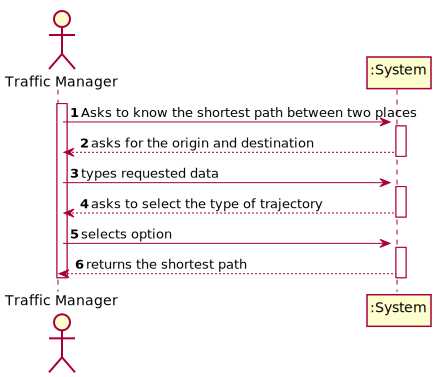
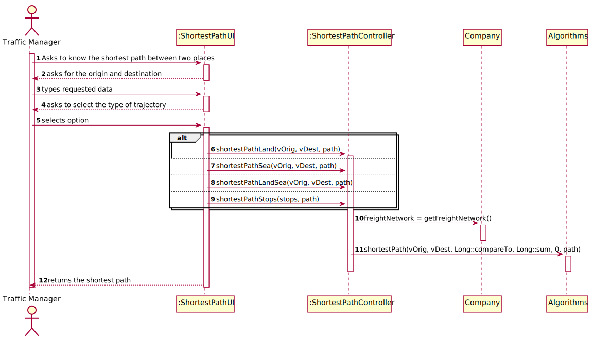
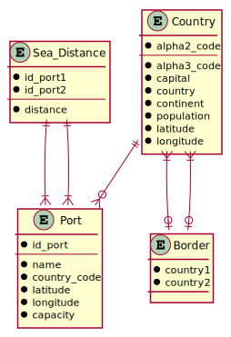
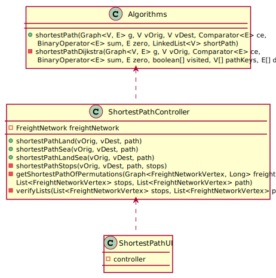

# US 402 - Know the shortest path between two places

## 1. Requirements Engineering

### 1.1. User Story Description

As a Traffic manager I wish to know the shortest path between two locals (city and/or port).

### 1.2. Acceptance Criteria

* **AC1:** Land path (only includes land routes, may start/end in port/city).
         
* **AC2:** Maritime path (only includes ports).

* **AC3:** Land or sea path (may include cities and ports).

* **AC4:** Obligatorily passing through n indicated places.

### 1.3. Found out Dependencies

* There is a dependency with US301:"Build Freight Network", since the program needs the data to calculate the distance between ports, between capitals and between both. 

### 1.4 Input and Output Data

**Input Data:**

* Typed data:
	* Origin and destination
	* (Stops)

* Selected data:
    * Type of trajectory

**Output Data:**

* Shortest path

### 1.5. Use Case Diagram (UCD)

### 1.6. System Sequence Diagram (SSD)

### 1.7 Other Relevant Remarks

none

## 2. OO Analysis

### 2.1. Relevant Domain Model Excerpt 

### 2.2. Other Remarks

none

## 3. Design - User Story Realization 

## 3.1. Sequence Diagram (SD)

## 3.2. Relational Model (RM)

## 3.3. Class Diagram (CD)

