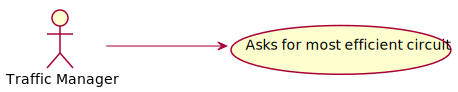
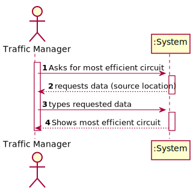
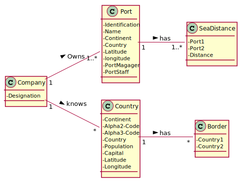
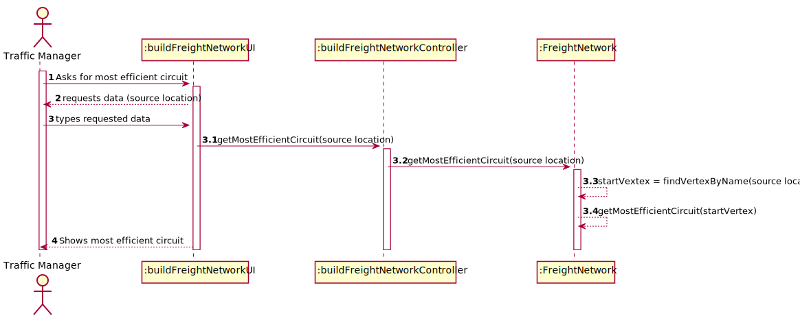
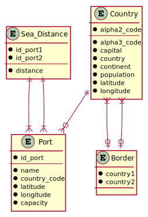
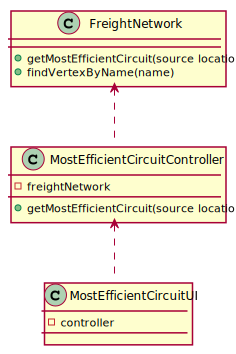

# US 403 - Most efficient circuit

## 1. Requirements Engineering

### 1.1. User Story Description

As a Traffic manager I wish to know the most efficient circuit that starts from a source location and visits the greatest number of other locations once, returning to the starting location and with the shortest total distance.

### 1.2. Acceptance Criteria

* **AC1:** Implement one of the heuristics used for this type of circuit.

### 1.3 Input and Output Data

**Input Data:**

* Typed data:
	* source location

* Selected data:
    * none

**Output Data:**

* most efficient circuit

### 1.4. Use Case Diagram (UCD)

### 1.5. System Sequence Diagram (SSD)

### 1.6 Other Relevant Remarks

none

## 2. OO Analysis

### 2.1. Relevant Domain Model Excerpt 

### 2.2. Other Remarks

none

## 3. Design - User Story Realization 

## 3.1. Sequence Diagram (SD)

## 3.2. Relational Model (RM)

## 3.3. Class Diagram (CD)

# 4. Tests 

    @Test
    void findVertexByName() {
        BuildFreightNetworkController controller = new BuildFreightNetworkController();
        FreightNetwork freightNetwork = controller.buildFreightNetwork(countries, ports, borders, seaDistances, 0);
        Assertions.assertEquals(country1, freightNetwork.findVertexByName(country1.getName()));
        Assertions.assertEquals(country2, freightNetwork.findVertexByName(country2.getName()));
        Assertions.assertNull(freightNetwork.findVertexByName("Invalid Name"));
    }
    
    @Test
    void getMostEfficientCircuit() {
        LinkedList<FreightNetworkVertex> expected = new LinkedList<>();
        expected.add(country1);
        expected.add(port1);
        expected.add(port2);
        expected.add(port3);
        expected.add(port4);
        expected.add(country2);
        expected.add(country1);
        Assertions.assertEquals(expected, freightNetwork.getMostEfficientCircuit("Belize"));
    }

# 5. Construction (Implementation)

## Class FreightNetwork

    public FreightNetworkVertex findVertexByName(String name) {
        boolean found = false;
        int i = 0;
        FreightNetworkVertex startVertex = null;

        while (!found && i < numVerts) {
            if ( vertices.get(i).getName().equalsIgnoreCase(name)) {
                found = true;
                startVertex = vertices.get(i);
            }
            i++;
        }
        return startVertex;
    }

    public LinkedList<FreightNetworkVertex> getMostEfficientCircuit(String sourceLocation) {
        LinkedList<FreightNetworkVertex> res = new LinkedList<>();
        FreightNetworkVertex startVertex = findVertexByName(sourceLocation);
        boolean[] visited = new boolean[numVertices()];
        FreightNetworkVertex vOrig = startVertex;
        Edge<FreightNetworkVertex, Long> shortestEdge;
        Long shortestDistance;

        if (startVertex != null) {
            res.add(vOrig);

            do {
                shortestDistance = Long.MAX_VALUE;
                shortestEdge = null;
                for (Edge<FreightNetworkVertex, Long> edge : outgoingEdges(vOrig)) {
                    if (!visited[key(edge.getVDest())] && (edge.getWeight() < shortestDistance)) {
                        shortestEdge = edge;
                        shortestDistance = shortestEdge.getWeight();
                    }
                }

                if (shortestEdge != null) {
                    vOrig = shortestEdge.getVDest();
                    if (vOrig != startVertex)
                        visited[key(vOrig)] = true;
                    res.add(vOrig);
                }
                else {
                    vOrig = res.getLast();
                    res.removeLast();
                }
            } while (vOrig != startVertex);
        }
        return res;
    }

# 6. Integration and Demo 

* Added a new option to the Traffic Manager menu.