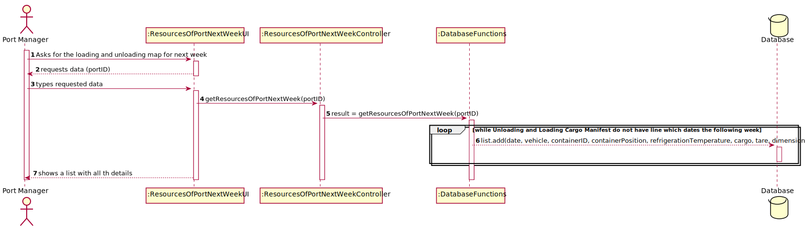

# US 407 - Generate, a week in advance, the loading and unloading map

## 1. Requirements Engineering

### 1.1. User Story Description

As Port manager, I intend to generate, a week in advance, the loading and
unloading map based on ships and trucks load manifests and corresponding travel plans, to anticipate the level of sufficient and necessary resources (loading and unloading staff,
warehouse staff, ...).

### 1.2. Acceptance Criteria

* **AC1:** Week in advance is properly identified.

* **AC2:** Loading and unloading map is comprehensive.

* **AC3:** Loading and unloading map is clear with respect to the sufficient and necessary resources for loading and unloading tasks.

### 1.3 Input and Output Data

**Input Data:**

* Typed data:
	* Port ID

* Selected data:
    * none

**Output Data:**

*  a List of date of load/unload, ship/truck identifier, number of containers to load/unload and the details of each one, mainly the position on the ship.

### 1.4. Use Case Diagram (UCD)

### 1.5. System Sequence Diagram (SSD)

## 2. OO Analysis

### 2.1. Relevant Domain Model Excerpt 

### 2.2. Other Remarks

none

## 3. Design - User Story Realization 

## 3.1. Sequence Diagram (SD)

## 3.2. Relational Model (RM)

## 3.3. Class Diagram (CD)

