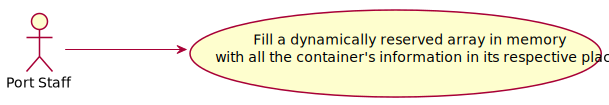
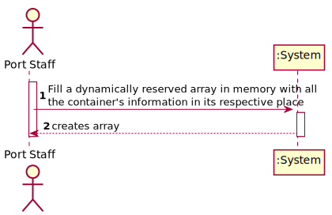
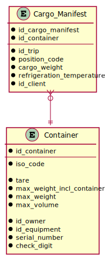

# US 409 - Fill a dynamically reserved array in memory with all the container's information in its respective place

## 1. Requirements Engineering

### 1.1. User Story Description

As a Port staff given a Cargo Manifest, I wish to fill a dynamically reserved array in memory with all the container's information in its respective place.

### 1.2. Customer Specifications and Clarifications 

**From the specifications document:**

> Containers can be transported by land or sea. Every ship has the containers according to a threeaxis displacement.
> Containers have certain characteristics such as:
 • Container Identification.
 • Container Payload, Tare and Gross.
 • Container dimensions (width, height, length) by using the ISO Code3
 • Let's assume two types of containers.
   o One type, will be containers to keep at refrigeration temperatures, that is, to keep
   at maximum interior temperatures of 7ºC.
   o The other type, will be to maintain interior temperatures of - 5ºC

### 1.3. Acceptance Criteria

* **AC1:** The array should be dynamically reserved in C, adjusting the size
           of the array to the amount of handled data.
           
* **AC2:** All the details of a container can be present in more than one file. As
           such, define a struct that represents a container. Therefore, in the end,
           you should have a matrix of structs.
           
* **AC3:** The data types chosen for each field of the struct should be adjusted to
           the types of values they store. Memory usage should be kept to the minimum required. Also consider the order of fields that minimizes
           memory consumption.
           
* **AC4:** The function should be developed in C.

### 1.4. Found out Dependencies
* There are no dependencies; 

### 1.5 Input and Output Data

**Input Data:**

* Typed data:
	* none

* Selected data:
    * none

**Output Data:**

* none

### 1.6. Use Case Diagram (UCD)

### 1.7. System Sequence Diagram (SSD)

### 1.8 Other Relevant Remarks

none

## 2. Design - User Story Realization 

## 2.1. Relational Model (RM)

