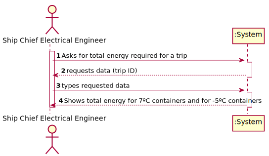

# US 413 - Energy to be supplied to the containers in a trip

## 1. Requirements Engineering

### 1.1. User Story Description

As Ship Chief Electrical Engineer, the objective is to know the total energy to be supplied to the set of containers in a certain established trip, assuming that all the containers have the same behaviour.

### 1.2. Acceptance Criteria

* **AC1:** Know the journey time.
* **AC2:** Know the temperature of the trip, or sections of the trip.
* **AC3:** Determine the total energy to be supplied to the set of containers with an operating temperature of 7 °C.
* **AC4:** Determine the total energy to be supplied to the set of containers with an operating temperature of - 5 °C.

### 1.3 Input and Output Data

**Input Data:**

* Typed data:
	* trip ID

* Selected data:
    * none

**Output Data:**

* total energy for 7ºC containers
* total energy for -5ºC containers

### 1.4. Use Case Diagram (UCD)

### 1.5. System Sequence Diagram (SSD)

### 1.6 Other Relevant Remarks

none

## 2. OO Analysis

### 2.1. Relevant Domain Model Excerpt 

### 2.2. Other Remarks

none

## 3. Design - User Story Realization 

## 3.1. Sequence Diagram (SD)

## 3.2. Relational Model (RM)

## 3.3. Class Diagram (CD)

# 4. Construction (Implementation)

## PL/SQL Function

    CREATE OR REPLACE FUNCTION tripEnergyDetails(trip_id Trip.id_trip%type) RETURN VARCHAR
    is
    
    start_time                      TIMESTAMP;
    end_time                        TIMESTAMP;
    trip_duration                   INTEGER;
    start_port                      Trip.id_start_port%type;
    end_port                        Trip.id_destination_port%type;
    country_1                       Country.alpha2_code%type;
    country_2                       Country.alpha2_code%type;
    cargo_manifest                  INTEGER;
    section_1_seconds               INTEGER;
    section_2_seconds               INTEGER;
    section_1_temperature           NUMBER;
    section_2_temperature           NUMBER;
    amount1                         INTEGER; -- -5ºC containers
    amount2                         INTEGER; -- 7ºC containers

    BEGIN
    
    select date_time_start into start_time
    from Trip
    where id_trip = trip_id;
    
    select date_time_end into end_time
    from Trip
    where id_trip = trip_id;
    
    select extract( day from diff )*24*60*60 +
           extract( hour from diff )*60*60 +
           extract( minute from diff )*60 +
           extract( second from diff ) into trip_duration
      from (select end_time - start_time diff from dual);

    section_1_seconds := trip_duration / 2;
    section_2_seconds := section_1_seconds;
    
    select id_start_port into start_port
    from Trip
    where id_trip = trip_id;
    
    select id_destination_port into end_port
    from Trip
    where id_trip = trip_id;
    
    select country_code into country_1
    from Port
    where id_port = start_port;
    
    select country_code into country_2
    from Port
    where id_port = end_port;
    
    select temperature into section_1_temperature
    from Country
    where alpha2_code = country_1;
    
    select temperature into section_2_temperature
    from Country
    where alpha2_code = country_2;
    
    select unique id_cargo_manifest into cargo_manifest
    from Cargo_Manifest
    where id_trip = trip_id;
    
    select count(*) into amount1
    from Cargo_Manifest
    where id_cargo_manifest = cargo_manifest and refrigeration_temperature = -5;
    
    select count(*) into amount2
    from Cargo_Manifest
    where id_cargo_manifest = cargo_manifest and refrigeration_temperature = 7;
    
    
    
    RETURN section_1_seconds || ',' || section_2_seconds ||',' || section_1_temperature || ',' || section_2_temperature || ',' || amount1 || ',' || amount2;
    
    END;
    /
    
    select tripEnergyDetails(4444) from dual;

## Class TripEnergyController

    public String getTripEnergy(int tripID) {
        String[] values = DatabaseFunctions.getTripEnergyDetails(tripID).split(",");
        if (!values[0].equals("An error occurred."))
            return calculateTripEnergy(Integer.parseInt(values[0]),
                                       Integer.parseInt(values[1]),
                                       Float.parseFloat(values[2]),
                                       Float.parseFloat(values[3]),
                                       Integer.parseInt(values[4]),
                                       Integer.parseInt(values[5]));
        else return values[0];
    }

    public String calculateTripEnergy(int seconds1, int seconds2, float temperature1, float temperature2, int amount1, int amount2) {
        double energy1 = 0;
        double energy2 = 0;
        DecimalFormat format = new DecimalFormat("0.00E00");

        ArrayList<Pair<WallMaterial, Double>> materialList1 = new ArrayList<>();
        materialList1.add(new Pair<>(WallMaterial.STAINLESS_STEEL, WallMaterial.STAINLESS_STEEL.getK()));
        materialList1.add(new Pair<>(WallMaterial.POLYURETHANE_FOAM, WallMaterial.POLYURETHANE_FOAM.getK()));
        materialList1.add(new Pair<>(WallMaterial.PLYWOOD, WallMaterial.PLYWOOD.getK()));
        RefrigeratedContainer type1part1 = new RefrigeratedContainer(materialList1, temperature1 + 5);
        double totalArea = 0;
        totalArea += type1part1.getWallArea("Door") * 2;
        totalArea += type1part1.getWallArea("Side") * 2;
        totalArea += type1part1.getWallArea("Top") * 2;
        double thermalFlux1part1 = 0;
        for (double thermalFlux : type1part1.getThermalFlux())
            thermalFlux1part1 += thermalFlux;
        energy1 += thermalFlux1part1 * seconds1 * totalArea;
        RefrigeratedContainer type1part2 = new RefrigeratedContainer(materialList1, temperature2 + 5);
        double thermalFlux1part2 = 0;
        for (double thermalFlux : type1part2.getThermalFlux())
            thermalFlux1part2 += thermalFlux;
        energy1 += thermalFlux1part2 * seconds2 * totalArea;
        energy1 *= amount1;

        ArrayList<Pair<WallMaterial, Double>> materialList2 = new ArrayList<>();
        materialList2.add(new Pair<>(WallMaterial.CORTEN_STEEL, WallMaterial.CORTEN_STEEL.getK()));
        materialList2.add(new Pair<>(WallMaterial.EXPANDED_POLYSTYRENE, WallMaterial.EXPANDED_POLYSTYRENE.getK()));
        materialList2.add(new Pair<>(WallMaterial.BAMBOO, WallMaterial.BAMBOO.getK()));
        RefrigeratedContainer type2part1 = new RefrigeratedContainer(materialList2, temperature1 - 7);
        double thermalFlux2part1 = 0;
        for (double thermalFlux : type2part1.getThermalFlux())
            thermalFlux2part1 += thermalFlux;
        energy2 += thermalFlux2part1 * seconds1 * totalArea;
        RefrigeratedContainer type2part2 = new RefrigeratedContainer(materialList2, temperature2 - 7);
        double thermalFlux2part2 = 0;
        for (double thermalFlux : type2part2.getThermalFlux())
            thermalFlux2part2 += thermalFlux;
        energy2 += thermalFlux2part2 * seconds2 * totalArea;
        energy2 *= amount2;

        return "Total energy for -5ºC containers: " + format.format(energy1) + " J.\nTotal energy for  7ºC containers: " + format.format(energy2) + " J.";
    }

# 5. Integration and Demo 

* Created a menu, and added an option for the Ship Chief Electrical Engineer