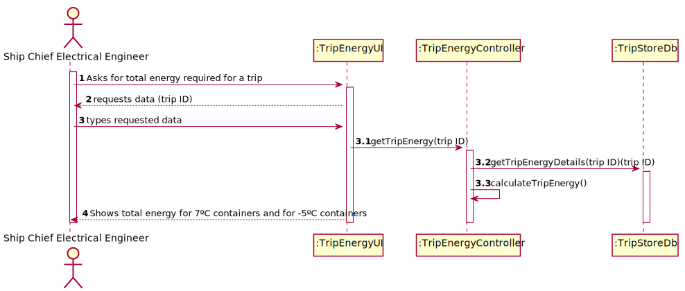
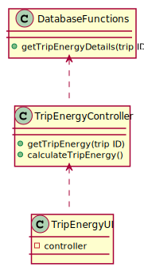

# US 413 - Energy to be supplied to the containers in a trip

## 1. Requirements Engineering

### 1.1. User Story Description

As Ship Chief Electrical Engineer, the objective is to know the total energy to be supplied to the set of containers in a certain established trip, assuming that all the containers have the same behaviour.

### 1.2. Acceptance Criteria

* **AC1:** Know the journey time.
* **AC2:** Know the temperature of the trip, or sections of the trip.
* **AC3:** Determine the total energy to be supplied to the set of containers with an operating temperature of 7 °C.
* **AC4:** Determine the total energy to be supplied to the set of containers with an operating temperature of - 5 °C.

### 1.3 Input and Output Data

**Input Data:**

* Typed data:
	* trip ID

* Selected data:
    * none

**Output Data:**

* total energy for 7ºC containers
* total energy for -5ºC containers

### 1.4. Use Case Diagram (UCD)

### 1.5. System Sequence Diagram (SSD)

### 1.6 Other Relevant Remarks

none

## 2. OO Analysis

### 2.1. Relevant Domain Model Excerpt 

### 2.2. Other Remarks

none

## 3. Design - User Story Realization 

## 3.1. Sequence Diagram (SD)

## 3.2. Relational Model (RM)

## 3.3. Class Diagram (CD)

# 4. Tests 

# 5. Construction (Implementation)

## Class

# 6. Integration and Demo 

* 