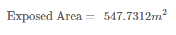

# US 414 - Know how much energy to supply to the container cargo, in a trip, depending on the position of the containers
##Theory
The thermal flux of any material is calculated using the following equation:

The resistance of any material is calculated using the following equation:

The resistance of a wall with three different materials is calculated using the following equation:
 

To calculate the energy necessary to supply to the container, we use the following equation:

##Procedure
>If is the same temperature for the whole trip, we just need to calculate the total area for each type of container, specified before. Then calculate the thermal flux and multiply by the seconds of the trip journey, getting the energy in J.

> If the trip has sections with different temperatures, first we need to calculate the exposed area of each type of containers, to maintain at -5ºC or 7ºC of temperature. 
>
> Then we can calculate the thermal resistance of the wall for the exposed and not exposed areas. We are going to need this for the thermal flux calculations.
>
>For the exposed area we need to calculate a thermal flux for each temperature of the trip and then multiply it by the time, in seconds, the ship  travels through that temperature. 
>For the not exposed area, we just need to calculate the thermal flux with the variation temperature at the start of the trip. Then we multiply that value by the time, in seconds, of the whole trip to get the energy necessary.
>We do this two steps for both types of containers, and the sum of all calculations is the energy necessary for to maintain all the containers at its temperatures.  

##Example
For this example, we are going to set the journey time for 2h and 30min, and we are going divide the trip into two sections, splitting the time, and with temperatures of 15ºC e 25ºC, respectively.
In therms of containers, there are 40 containers, 25 at a temperature of 7ºC and 15 at a temperature of -5ºC. They are in a block of 4x5x2 as shown in the image below. For simplifications, all containers have the same dimensions, 6.10m x 2.44m x 2.44m.    

In this disposition, we can see containers from 3 to zero sides exposed to the sun. 

###Containers to maintain -5ºC of temperature
There are 15 containers to maintain -5ºC of temperature, 6 of them have the top side exposed to the sun, other 3 just have a door exposed, with the rest completely covered.

From previous equation, we can now calculate the thermal resistance and flux, and the energy to be spent. The calculations were made in the java application, using the equations in the theory chapter. 

###Containers to maintain 7ºC of temperature
There are 25 containers to maintain 7ºC of temperature, 4 of them have the top side, a door and a side exposed to the sun, other 4 just have a door and a side exposed, 4 with top and side exposed, 4 with just a side exposed, 6 with the top and a door exposed, and finally 3 with just a door exposed. 

From previous equation, we can now calculate the thermal resistance and flux, and the energy to be spent. The calculations were made in the java application, using the equations in the theory chapter. 

 

## 1. Requirements Engineering

### 1.1. User Story Description

As Ship Chief Electrical Engineer, you want to know how much energy to supply
to the container cargo, in a voyage (or route), depending on the position of the containers
on the ship. Admitting that the interior containers, or the sides not exposed directly to the
"sun", maintain the initial temperature, or of departure. However, the exposed sides may
present temperature variations during the trip.

### 1.2. Acceptance Criteria

* **AC1:** Know the journey time.

* **AC2:** Know the temperatures of the travel sections.
           
* **AC3:** Know how many sides of each container are subject to temperature variation.
                      
* **AC4:** Determine the energy required for one trip of the containers at a temperature of 7 ºC, depending on their position in the load.
 
* **AC5:** Determine the energy required for one trip of the containers at a temperature of -5 ºC, depending on their position in the cargo 
                                  

### 1.3 Input and Output Data

**Input Data:**

* Typed data:
	* energy per type of container
	* energy as function of container positions

* Selected data:
    * sides of the container exposed to the sun

**Output Data:**

* the amount of energy needed to maintain the containers

### 1.4. Use Case Diagram (UCD)

### 1.5. System Sequence Diagram (SSD)

### 1.6 Other Relevant Remarks

none

## 2. OO Analysis

### 2.1. Relevant Domain Model Excerpt 

### 2.2. Other Remarks

none

## 3. Design - User Story Realization 

## 3.1. Sequence Diagram (SD)

## 3.2. Relational Model (RM)

## 3.3. Class Diagram (CD)

