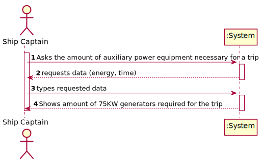
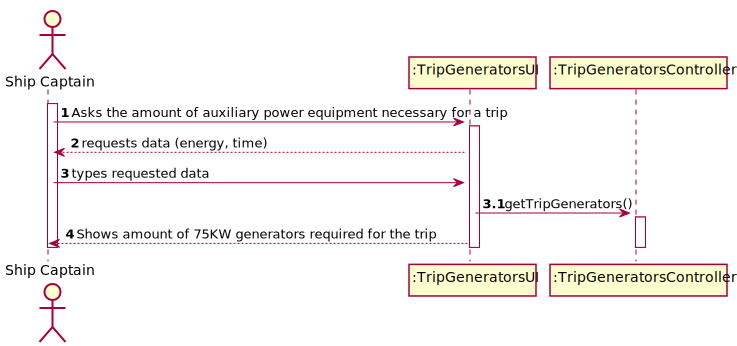

# US 415 - How many auxiliary power equipment are needed

## 1. Requirements Engineering

### 1.1. User Story Description

As the ship's captain I need to know how many auxiliary power equipment are needed for the voyage, knowing that each one supplies a maximum of 75 KW.

### 1.2. Acceptance Criteria

* **AC1:** Know the amount of energy required per type of container for a trip.
* **AC2:** Determine the total energy required to load containers on a given voyage (or route) as a function of their position in the load.
* **AC3:** Determine how many generators of the stated power are required for the trip.

### 1.3 Input and Output Data

**Input Data:**

* Typed data:
	* energy
	* time

* Selected data:
    * none

**Output Data:**

* amount of 75KW generators required for the trip

### 1.4. Use Case Diagram (UCD)

### 1.5. System Sequence Diagram (SSD)

### 1.6 Other Relevant Remarks

none

## 2. OO Analysis

### 2.1. Relevant Domain Model Excerpt 

### 2.2. Other Remarks

none

## 3. Design - User Story Realization 

## 3.1. Sequence Diagram (SD)

## 3.2. Relational Model (RM)

## 3.3. Class Diagram (CD)

# 4. Tests 

    @Test
    void getTripGenerators() {
        TripGeneratorsController controller = new TripGeneratorsController();
        double energy = 2.46E12;
        int seconds = 604800;
        long expected = 55;
        long actual = controller.getTripGenerators(energy, seconds);
    }

# 5. Construction (Implementation)

## Class TripGeneratorsController

    private final int GENERATOR_ENERGY = 75000;

    public long getTripGenerators(double energy, int seconds) {
        long res = 0;

        res = (long) Math.ceil((energy/seconds)/GENERATOR_ENERGY);

        return res;
    }

# 6. Integration and Demo 

* Added a new option to the Ship Captain menu.