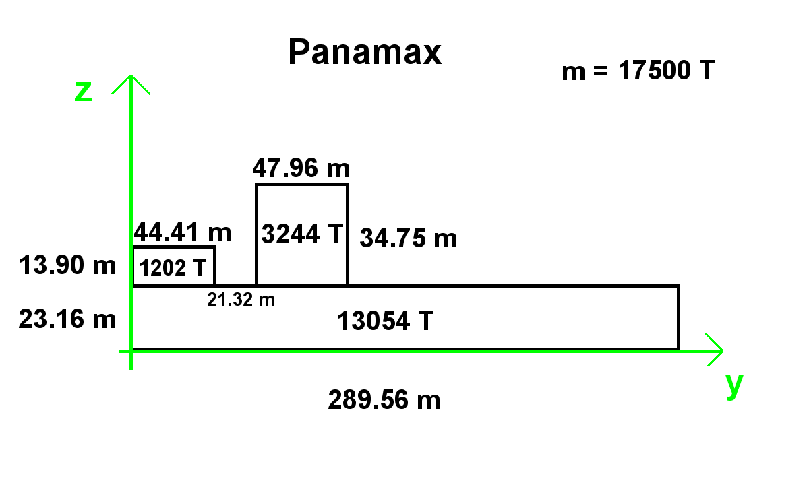
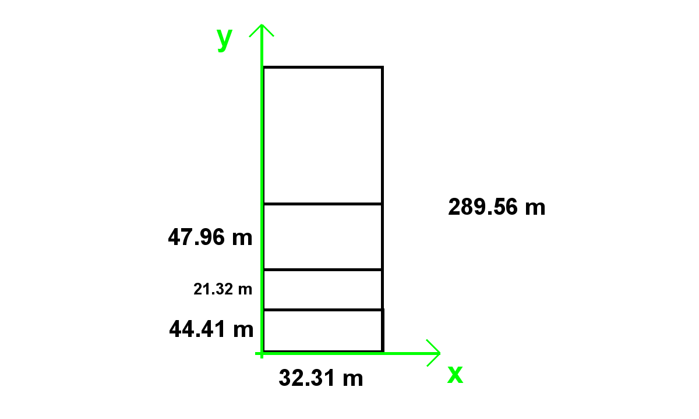
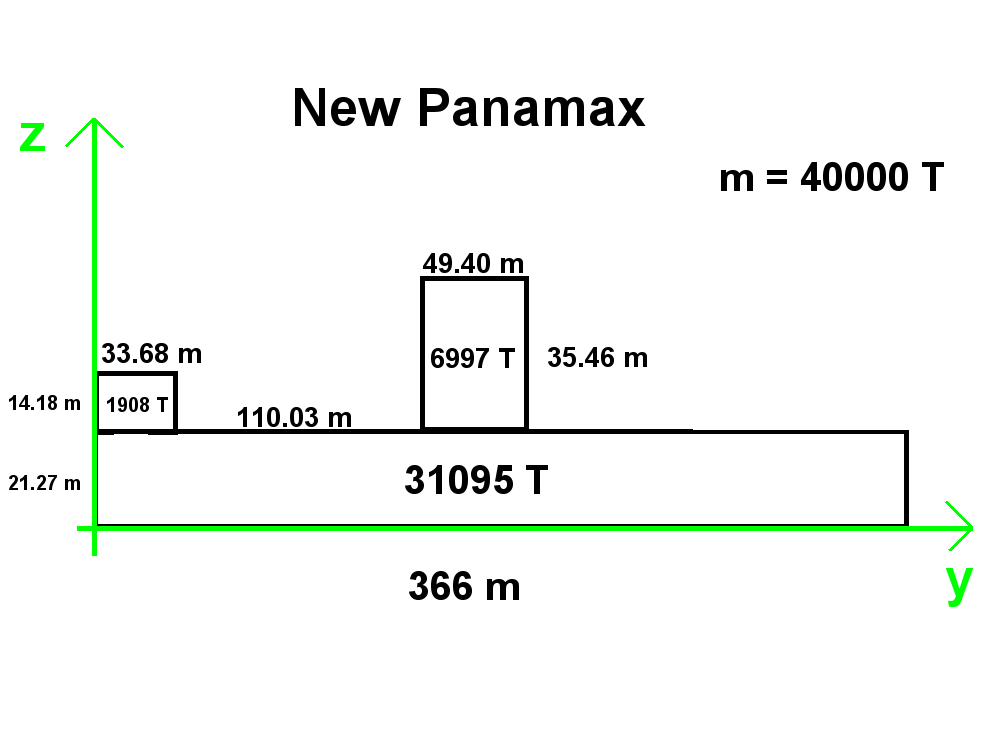
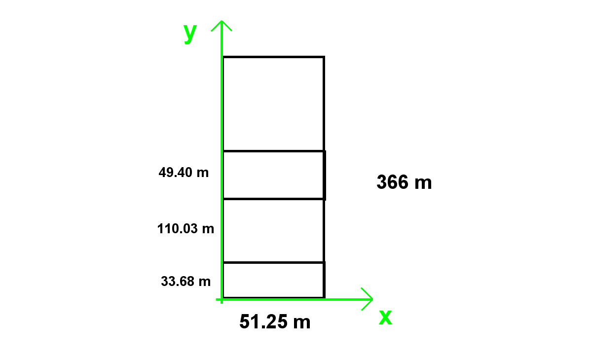
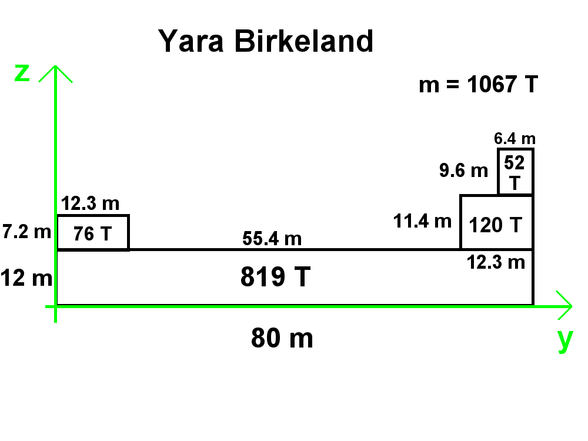
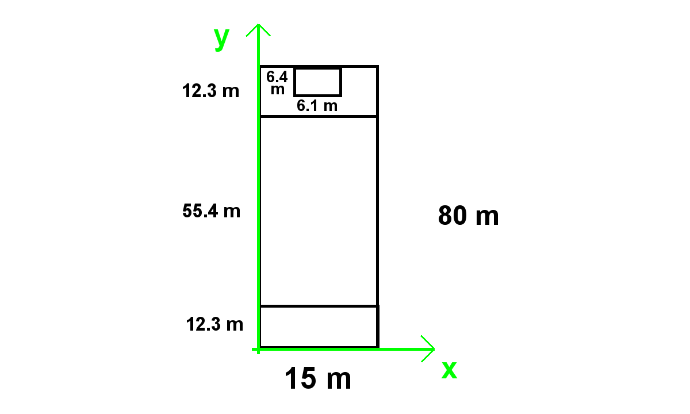

# US 413 - Energy to be supplied to the containers in a trip

## 1. Requirements Engineering

### 1.1. User Story Description

As the Ship Captain I want to determine the unladen center of mass for each vessel (if different) according to its characteristics. For calculation purposes, consider known geometric figures.

### 1.2. Acceptance Criteria

* **AC1:** Make a sketch of the vessel's geometric figure.
* **AC2:** Identify/choose a reference for the calculation.
* **AC3:** Determine the center of mass for the different vessels (consider that the vessel is all made of the same material).

### 2 Sketches

