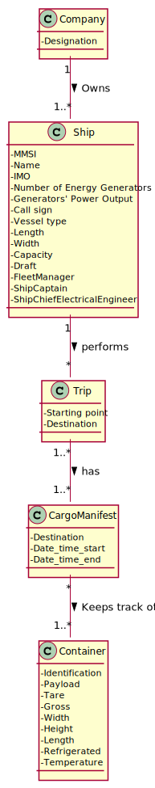

# US 419 - Know where to position containers on the vessel such that the center of mass remains at xx and yy

## 1. Requirements Engineering

### 1.1. User Story Description

As the Ship Captain I want to know where to position, for example, one hundred
(100) containers on the vessel, such that the center of mass remains at xx and yy,
determined in the previous point.

### 1.2. Acceptance Criteria

* **AC1:** Identify the area/volume of a container and its center of mass. The
           distribution of the mass inside the container will be considered uniform.
         
* **AC2:** Make a sketch of the distribution and loading on the vessel

* **AC3:** Calculate the center of mass of the sketch performed

### 1.3 Input and Output Data

**Input Data:**

* Typed data:
	* x, y, z max
	* center of mass original relative to the x and y from above 
	* mass of the vessel
	* information on the containers to load

* Selected data:
    * none 

**Output Data:**

* layout of the containers
* new center of mass

### 1.4. Use Case Diagram (UCD)

### 1.5. System Sequence Diagram (SSD)

### 1.6 Other Relevant Remarks

none

## 2. OO Analysis

### 2.1. Relevant Domain Model Excerpt 

### 2.2. Other Remarks

none

## 3. Design - User Story Realization 

## 3.1. Sequence Diagram (SD)

## 3.2. Relational Model (RM)

## 3.3. Class Diagram (CD)

