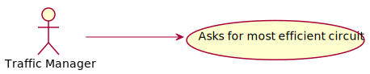
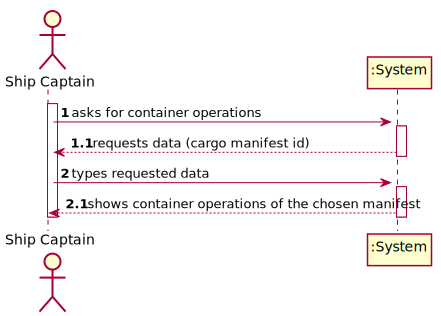
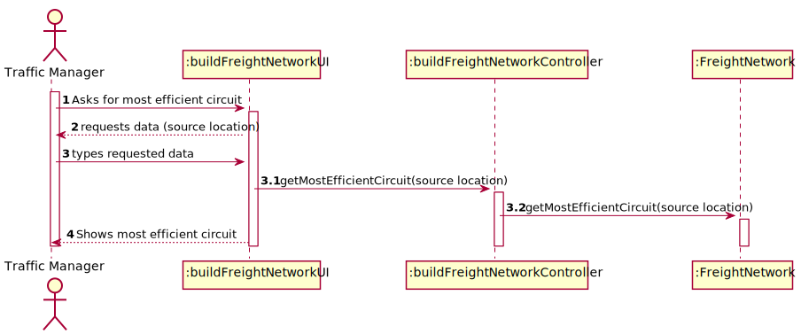
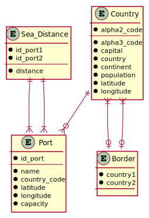
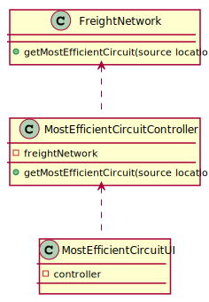

# US 403 - Most efficient circuit

## 1. Requirements Engineering

### 1.1. User Story Description

As a Traffic manager I wish to know the most efficient circuit that starts from a source location and visits the greatest number of other locations once, returning to the starting location and with the shortest total distance.

### 1.2. Acceptance Criteria

* **AC1:** Implement one of the heuristics used for this type of circuit.

### 1.3 Input and Output Data

**Input Data:**

* Typed data:
	* source location

* Selected data:
    * none

**Output Data:**

* most efficient circuit

### 1.4. Use Case Diagram (UCD)

### 1.5. System Sequence Diagram (SSD)

### 1.6 Other Relevant Remarks

none

## 2. OO Analysis

### 2.1. Relevant Domain Model Excerpt 

### 2.2. Other Remarks

none

## 3. Design - User Story Realization 

## 3.1. Sequence Diagram (SD)

## 3.2. Relational Model (RM)

## 3.3. Class Diagram (CD)

# 4. Tests 

# 5. Construction (Implementation)

## Class

# 6. Integration and Demo 

* 