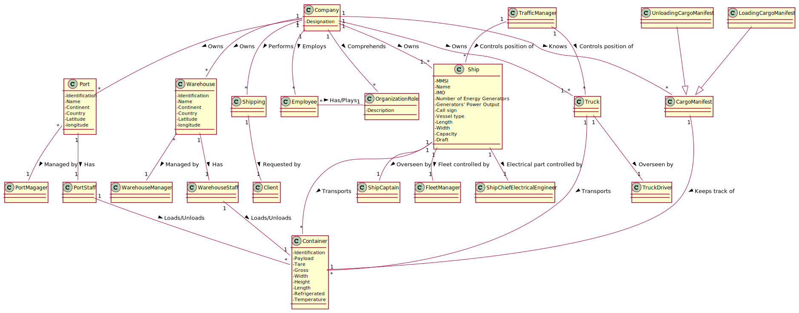

### Conceptual Class Category List ###

**Business Transactions**

* Shipping

**Transaction Line Items**

* Container

**Product/Service related to a Transaction or Transaction Line Item**

*  

---

**Transaction Records**

* Cargo Manifest (Loading/Unloading)

**Roles of People or Organizations**

* Client
* Employee
* Organization Role
* Fleet manager
* Traffic manager
* Warehouse staf
* Warehouse manager
* Port staff
* Port manager
* Ship captain
* Ship chief electrical engineer
* Truck driver

**Places**

* Warehouse
* Port

**Noteworthy Events**

*

---

**Physical Objects**

* Ship
* Truck

**Descriptions of Things**

*  

--- 

**Catalogs**

*  

---

**Containers**

*  

---

**Elements of Containers**

*  

---

**Organizations**

*  Company

**Other External/Collaborating Systems**

*  

---

**Records of finance, work, contracts, legal matters**

* 

---

**Financial Instruments**

*  

---

**Documents mentioned/used to perform some work/**

* 
---

###**Rationale to identify associations between conceptual classes** ###

| Concept (A) 		|  Association   	        |  Concept (B)      |
|-------------------|---------------------------|-------------------|
| Company           | Performs    		 	    | Shipping          |
| "  	            | Owns   		 	        | Ship              |
| "  	            | Owns    		          	| Truck             |
| "  	            | Owns   		 	        | Port              |
| "  	            | Owns    		          	| Warehouse         |
| "  	            | Employs   		        | Employee          |
| "  	            | Knows   		            | Cargo Manifest    |
| "  	            | Comprehends    		 	| Organization Role |
| Employee          | Has/Plays    	            | Organization Role |
| Shipping          | Requested by    		 	| Client            |
| Port              | Managed by    	        | Port Manager      |
| "                 | Has    	                | Port Staff        |
| Warehouse         | Managed by    	        | Warehouse manager |
| "                 | Has    	                | Warehouse Staff   |
| Ship              | Overseen by  	            | Ship captain      |
| "     	        | Transports    	        | Container         |
| "     	        | Electrical part controlled by | Ship Chief Electrical Engineer |
| "                 | Fleet controlled by       | Fleet Manager   |
| Truck             | Overseen by 	            | Truck driver      |
| "     	        | Transports    	        | Container         |
| Traffic manager   | Controls position of      | Ship              |
| "                 | Controls position of      | Truck             |
| Warehouse staff   | Unloads/Loads   	        | Container         |
| Port staff        | Unloads/Loads   	        | Container         |
| Cargo Manifest    | Keeps track of   	        | Container         |

## Domain Model

